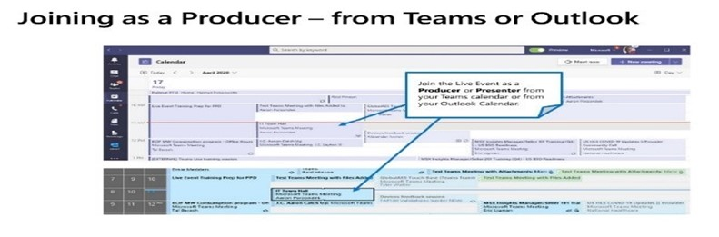
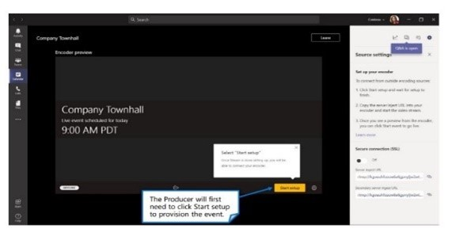
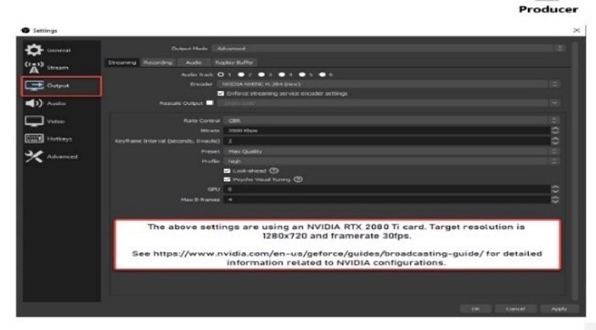
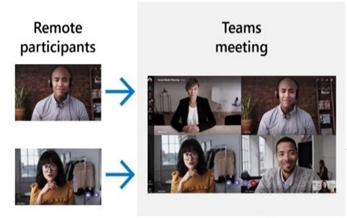

Once you’ve set up the live event and the content source, in this case, using Teams, there are several external applications for production (encoders) that you can use to customize the virtual event experience. An encoder compresses audio and video from various inputs and sends that output to a streaming service. Some popular encoders are OBS Studio, Halvision and Switcher Studio. For your custom live event, you’ll use OBS Studio. 
 

**Note**: Nothing can replace a dress rehearsal. This allows you to test all configurations and content switching to streamline the audience experience. 

## Produce your event using an app/device
To start the production setup, the Producer needs to join the live event from their Teams calendar or Outlook calendar.

After you have joined, click Start Setup to provision the event

Once the setup is complete, use the URLs listed on the bottom right to connect the encoder

**Note**: When a Teams Live Event is produced using an external app or encoder, Presenters for this event will not have any type of audio/video capabilities. They will be able to moderate the Q&A panel (if enabled), chat with the producer(s), and view the live stream within the client.

## Go Live
 Now you have connected your encoder. Before you go live with custom produced Live Event, make sure to configure your OBS Studio settings to the following:

Launch OBS, go to **File** -> **Settings** .
Click **Output**, then choose **Advanced** output mode and configure the following settings:
- **Encoder**: If your PC supports hardware encoding pick the one that's not x264 (ex-     Quick Sync H.264, NVENC, etc.). If hardware encoding isn't an option leave it as x264.  
- **Rate Control**: Make sure CBR is selected.  
- **Bitrate**: Enter a value in kbps, 2000 to 4000 is what is normally used. 
- **Keyframe Interval**: 2. 
 
Click **Audio** -> Configure **Track 1** -> **Audio Bitrate**: 128, 160, or 192 for audio encoding.  

Click **Video** and Configure the following settings
- **Base (Canvas) Resolution**: This is your normal desktop resolution (usually 1920 x 1080).
- **Output (Scaled) Resolution**: 1280 x 720 (Encoder Profiles are maxed at 720p in Stream for Live Events).
- **Common FPS Values**: 30 is normally used for frames per second.

## Extracting content from Teams as a (content source) 
 In our scenario, we are using a Teams meeting as our content source. Remember, this is the Source machine, and it joins the Teams meeting and uses NDI to extract the isolated video feeds and mixed audio feed.  

**The Producer must**: 
- Enable NDI in the Teams client
- Ensure video feeds are active in the Teams client
- Pin select videos as desired (max of 9 video feeds)
- Invoke the Large Gallery (Preview)
- Invoke the Together Mode (Preview) Enable Broadcast over NDI in Teams meeting
- NDI feeds contain mixed audio of all participants, except the user on the Source machine 
 

## Bringing in sources to the Producers Machine (using OBS as an example)
 **Note**: This is the Producer’s machine, and it runs the production software (e.g., OBS, Wirecast, vMix) to produce the desired layouts. From here, you can send the feed to your external audience.
- Install OBS and the OBS NDI Plugin (requires restart) 
- In OBS, create a new Scene, and add a new NDI source

- Select the desired feed and position into the scene

**Note**: both audio and video must be present.

