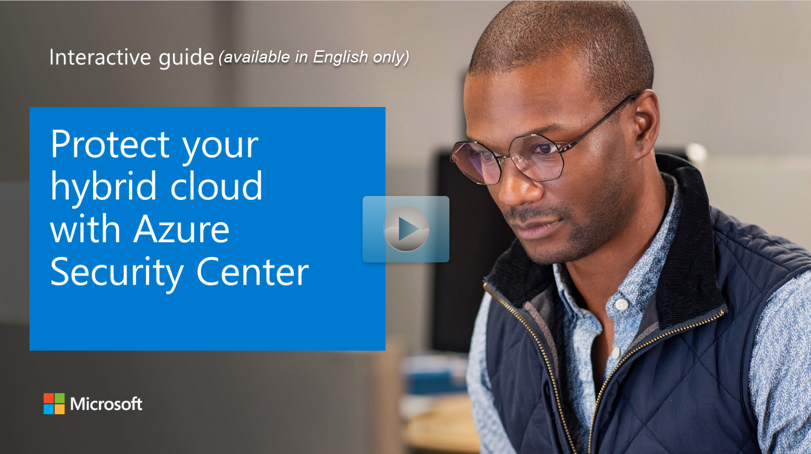

It's important to take a proactive approach to prevent security issues from happening, and to have appropriate solutions in place to handle any problems when they're identified.

To achieve this, you need to have a robust cloud security posture in place for your environment. You can then identify components and systems that don't meet your security and compliance best practices and standards, and deal with them appropriately.

Here, you'll learn how to improve your cloud security posture with Microsoft Defender for Cloud.
Microsoft Defender for Cloud helps you manage your cloud security posture through several measures, including:

## Secure score

Microsoft Defender for Cloud will continually look for security issues with subscriptions and resources across your organization. It will then aggregate all of its findings into a single score to give an indication of your current security situation. The higher the secure score, the lower the identified risk level for your organization. To find more details about your secure score, you can select it in the Microsoft Defender for Cloud overview dashboard:

:::image type="content" source="../media/3-secure-score.png" alt-text="Secure score":::

You can review the secure score, and then begin to work on improving it. You'll see the overall score, and how it's split across your subscriptions:

:::image type="content" source="../media/3-secure-score-dashboard-inline.png" lightbox="../media/3-secure-score-dashboard-expanded.png" alt-text="Screenshot showing the Secure score dashboard":::

Select any subscription to find out how its score has been calculated:

:::image type="content" source="../media/3-secure-score-calculation-inline.png" lightbox="../media/3-secure-score-calculation-expanded.png" alt-text="Secure score calculation":::

You'll see a list of controls. Each control is made up of a group of related recommendations to deal with a specific risk, along with detailed instructions about how to implement them. Your secure score is calculated using these controls. The controls are prioritized for you in the top down list, so that you're aware of which ones to take care of first. Each control will only help you increase your secure score if you get maximum points for that specific control. You only get all those points if you implement all of its associated recommendations. For example, the **Manage access and permissions control** has several recommendations that need to be implemented to get its maximum number of points (four):

:::image type="content" source="../media/3-control-breakdown-inline.png" lightbox="../media/3-control-breakdown-expanded.png" alt-text="Breakdown" :::

If a recommendation in a control has the **Quick Fix** option, select it to apply the recommendation automatically:

:::image type="content" source="../media/3-apply-quick-fix-secure-score-inline.png" lightbox="../media/3-apply-quick-fix-secure-score-expanded.png" alt-text="Apply the recommendation":::

> [!NOTE]
> You can also access your secure score programmatically through the Microsoft Defender for Cloud REST API, to query data and generate your own reports.

### Improved automation

It can be difficult to remediate issues across a large fleet of resources and subscriptions. Microsoft Defender for Cloud helps you manage this scenario better through automation in several ways:

#### Quick Fix recommendations

You can use **Quick Fix** to implement certain recommendations across multiple resources. When you select **Quick Fix**, you can choose the resources that this recommendation should be implemented across. For example, for the **Secure transfer to storage accounts should be enabled** Quick Fix recommendation, you select which storage accounts should be remediated:

:::image type="content" source="../media/3-secure-transfer-storage-accounts-recommendation-inline.png" lightbox="../media/3-secure-transfer-storage-accounts-recommendation-expanded.png" alt-text="Secure storage accounts recommendation":::

At the top of the pane, you'll also see a general description and details of the remediation, and information on how to remediate it manually if you wish. When you select **Remediate**, a pane appears on the right for you to review what this remediation will do, and the implications. If you're happy to go ahead, select **Remediate resources**:

:::image type="content" source="../media/3-select-remediate-resources-inline.png" lightbox="../media/3-select-remediate-resources-expanded.png" alt-text="Remediate resources":::

## Workflow automation with Logic Apps

Using Microsoft Defender for Cloud's workflow automation feature, you can configure Logic Apps to be triggered on security alerts or recommendations, so that entire workflows are automatically carried out in response. For example, you can automate a process to ensure that a certain user is notified via email to carry out an investigation whenever a specific alert is raised by Microsoft Defender for Cloud.

To use workflow automation with Logic Apps, you'll have to create a Logic App and define when it should be run. For example, to trigger an email to be sent to an admin in response to alerts, you do the following steps:

> [!NOTE]
> There are specific roles and permissions that are required to complete these steps. See the link in the **Learn more** section.

1. In Microsoft Defender for Cloud, select **Workflow automation**.

1. Select **Add workflow automation**.

    :::image type="content" source="../media/3-select-add-workflow-automation.png" alt-text="Add workflow automation":::

1. In the pane that appears on the right, fill in the form, like this:

    :::image type="content" source="../media/3-add-workflow-automation-form.png" alt-text="Add workflow automation form":::
    1. Provide a name and description for your automation in the **name** and **description** fields.

    1. Select a subscription in the **subscription** field then select a resource group in the **resource group** field.

    1. Under **Trigger conditions**, select the trigger that will start this automated workflow.  For example, you can select **Threat detection alerts** in the **Select Defender for Cloud data types** field. 

    1. Select **High** in the **Alert severity** field and clear the other fields for it to be triggered only for threat detection alerts that have high alert severity.

    1. Under **Actions**, select the **visit the Logic Apps page** link to create a new Logic App.

    1. You'll be taken to the Logic Apps pane. Select **Add**:
    :::image type="content" source="../media/3-select-add-logic-app.png" alt-text="Add logic app":::

Now you can configure your Logic App.

1. In the form that appears, select your subscription and resource group. Give your Logic App a name, then select a region. When you're done, select **Review + Create,** then select **Create**:

    :::image type="content" source="../media/3-select-review-create-logic-app.png" alt-text="Select review and create logic app":::

1. Wait until your Logic App has been
created, then select **Go to resource**.

    :::image type="content" source="../media/3-logic-app-resource.png" alt-text="Go to resource":::

1. In the Logic App designer, select **Security** in the **Category** field:

    :::image type="content" source="../media/3-security-category-app-designer.png" alt-text="App designer security category":::
1. Select **Get a notification email when Defender for Cloud detects a threat**. Then select **Use this template**.

1. Configure an Office 365 Outlook connector by selecting the **+** next to the **Office 365 Outlook** field.

    :::image type="content" source="../media/3-add-outlook-connector.png" alt-text="Add Outlook connector":::

1. When you're done, select the **+** next to the **Defender for Cloud Alert** field, then select **Continue**. Now you can configure the details for the emails you want to send for alerts:

    :::image type="content" source="../media/3-configure-email-details-inline.png" lightbox="../media/3-configure-email-details-expanded.png" alt-text="Configure email details":::

    When you're done, select **Save**.

1. Return to the **Add workflow automation** tab on your browser.
    1. Make sure to select an appropriate subscription, or subscriptions, in the **Show Logic App instances from the following subscriptions** field.

    1. Select **Refresh** at the bottom of the form. You can select your Logic App in the **Logic App name** field. Then select **Create** when you're done:

    :::image type="content" source="../media/3-select-logic-app.png" alt-text="Select Logic App":::

## Continuous export

You might want to export information about alerts and recommendations for reporting purposes, or to feed this information into other monitoring tools (such as a SIEM) that you might already have in your environment. Microsoft Defender for Cloud lets you:

- Continuously export data to Log Analytics workspaces.

- Continuously export data to Azure Event Hubs, to feed into non-Microsoft solutions.

- Export to CSV on an ad-hoc basis.

For example, you can configure a continuous export to a Log Analytics workspace:

1. In Microsoft Defender for Cloud, select **Pricing & settings** on the left pane.

1. Select the subscription for which you want to configure an export. Then Select **Continuous export** on the left. The **Continuous export** pane appears.

    :::image type="content" source="../media/3-select-continuous-export.png" alt-text="Select continuous export":::

1. Select the **Log Analytics workspaces** tab.

1. Set **Export enabled** to **On**.

1. You can then select the data type you want to export. For example, **security alerts**. You can also select the specific severity levels of alerts that you want to be exported; for example, **high**.

1. Under the **export configuration** section, select the resource group where your configuration will be stored.

1. In the export target section, choose the relevant subscription that contains your workspace, and then select the target workspace. When you're done, select **Save**.

## Regulatory compliance

The regulatory compliance pane helps you to better understand and improve your
compliance posture. Select **Regulator compliance** on the overview pane of the workload protection dashboard to access the regulatory compliance dashboard:

:::image type="content" source="../media/3-regulatory-compliance.png" alt-text="Regulatory compliance":::

The regulatory compliance dashboard gives an overview of your environment's compliance status, based on the assessments made against your environment for a particular standard and its associated controls. For example, you could use it to see how you're matching up to the Azure Security Benchmark, based on its associated controls:

:::image type="content" source="../media/3-regulatory-compliance-breakdown.png" alt-text="Regulatory compliance breakdown":::

To remediate compliance issues, you expand the list of controls and select the recommendations to implement them.

The Azure Security Benchmark consists of a collection of high-impact security recommendations that you can use to help secure most of your services in Azure. It's based on well-known security benchmarks, like the Center for Internet Security (CIS) Control Framework. Most customers tend to structure their security policies around these frameworks, so the benchmark will most likely help you to understand how to best secure your resources.

You can also generate reports for a standard. For example, you can download a report for the Azure Security Benchmark, by selecting **Download report**, and then selecting **Azure Security Benchmark** in the dropdown:

:::image type="content" source="../media/3-select-download-report-inline.png" lightbox="../media/3-select-download-report-expanded.png" alt-text="Download report":::

Reports give a high-level summary of your compliance status against your selected standard. You can share these reports with stakeholders, and provide them for internal and external auditing.

### Create custom policies

You can create your own policies that Microsoft Defender for Cloud uses to assess your environment. You'll then receive recommendations if your environment doesn't match up to them. You can create custom policies by using the following steps:

1. In Microsoft Defender for Cloud, in the left pane, select **Security policy** under **Policy & compliance**.

1. Select the subscription or management group where you want to apply your policy.

1. In the pane that appears, select **Add a custom initiative** under **Your custom initiatives**:

    :::image type="content" source="../media/3-add-custom-initiative.png" alt-text="Add custom initiative":::
1. The **Add custom initiatives** pane appears. You then select **Create new** at the top.

1. In the **Initiative definition** pane, provide the following values:

    | **Field**               | **Description**                                              |
    | ----------------------- | ------------------------------------------------------------ |
    | **Definition location** | The location of your initiative definition. Defaults to the   subscription or management group you selected earlier. |
    | **Name**                | The name of your initiative definition.                      |
    | **Description**         | Describe what the initiative is used for.                    |
    | **Category**            | Enter a category name for this initiative definition, or select one   that already exists. |

1. On the right, select the policy definitions you want to include in this initiative definition. Some policy definitions allow you to set parameters when you add a new policy definition.

    :::image type="content" source="../media/3-add-policy-definition.png" alt-text="Add policy definition":::

1. Select **Save** then, in the **Add custom initiatives** pane, select **Add** in the list that appears.

    :::image type="content" source="../media/3-select-add-custom-initiative.png" alt-text="Select Add custom initiative":::

    1. In the pane that appears, review the basic information about your custom policy. Make sure that **Policy enforcement** is set to **Enabled**. Then select **Review + create**.

    1. Review the details one final time, then select **Create**.

Your custom initiative will start to take effect. You'll find it in your compliance dashboard, listed alongside the built-in initiatives.

## Networking security

Microsoft Defender for Cloud will continuously monitor your environment based on network security best practices. When Microsoft Defender for Cloud finds potential security risks, it will give alerts and recommendations to help you understand how to best deal with them. The network map is a tool in Microsoft Defender for Cloud to help you understand the state of your Azure network and remediate any identified issues.

:::image type="content" source="../media/3-network-map.png" alt-text="Network map":::

You can use the network map to see the network topology of your workloads in Azure, and the connections between your virtual machines, virtual networks, and subnets. Use the map to drill down into specific resources to get a better understanding of them, along with the recommendations for those resources. To view the network map, you:

1. Select **Networking** under **Resource Security Hygiene**, on the left pane of the Microsoft Defender for Cloud.

1. In the network map pane, select **See topology**.

    :::image type="content" source="../media/3-select-see-typology.png" alt-text="See typology":::

You can use filters at the top of the topology to specify what you want to see. For example, you might want to see only high or medium severity security issues, or security issues of all severity.

You select a specific resource to drill down into it, and view the recommendations. Details and recommendations for that specific resource will show in a pane that appears on the right:

:::image type="content" source="../media/3-network-details-inline.png" lightbox="../media/3-network-details-expanded.png" alt-text="View network details":::

### Explore how to protect your hybrid cloud with Microsoft Defender for Cloud

View a [video version](https://www.microsoft.com/videoplayer/embed/RE4GsND) of the interactive guide (captions available in more languages).

  

Be sure to click the full-screen option in the video player. When you're done, use the **Back** arrow in your browser to come back to this page. 

## Learn more

- [Workflow automation required roles and permissions](/azure/security-center/workflow-automation#availability)
