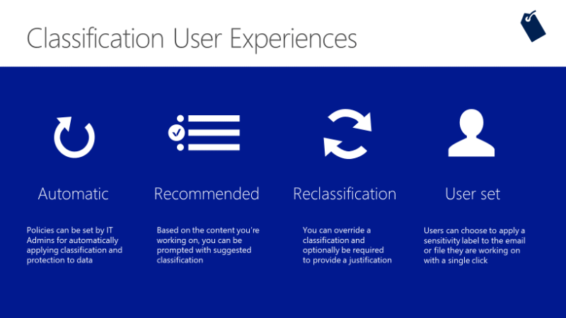
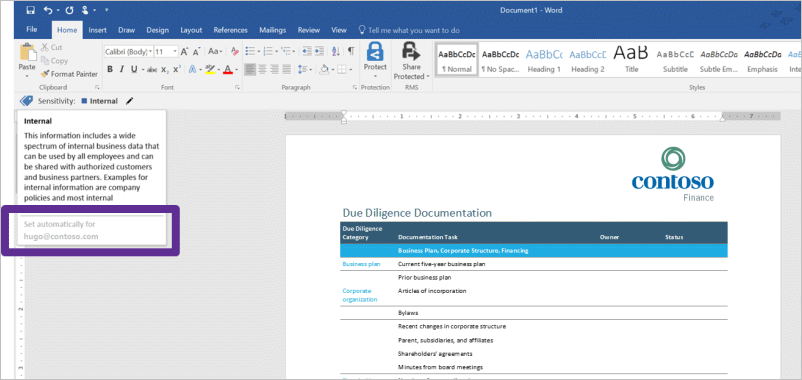
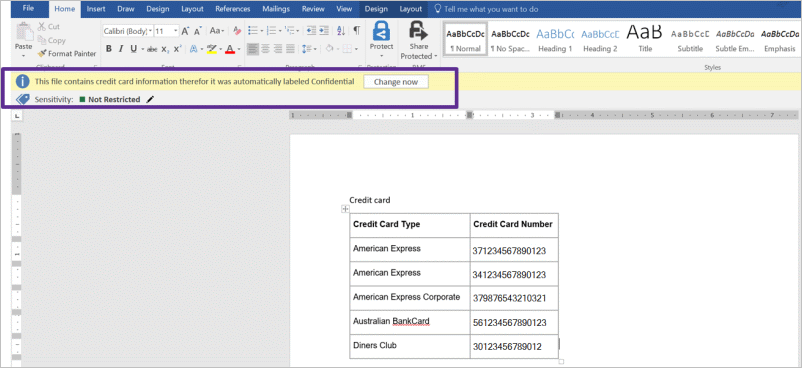
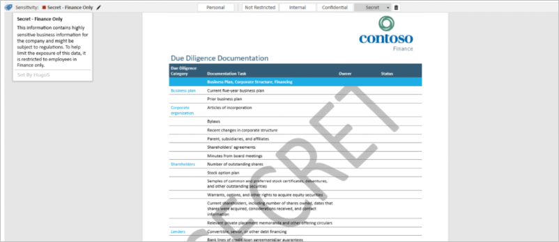

When a user creates or views a document with information protection enabled, they see four data classification options.

- **Automatic**

  - Policies set by IT automatically classify and label documents according to the data they contain.
  - The policies automatically apply protection.
  - User receives notification of the automatic labeling.

    

- **Recommended**

  - Policies automatically classify and label documents according to the data they contain.
  - User receives notification and can change the label.

    

- **Reclassification**

  - Users can reclassify the data or remove the label.
  - Policy can optionally require users to provide a justification; it is audited.

    

- **User-set**

  - Users can manually classify the document.
  - User classification determines which labels and protections automatically apply.

    
