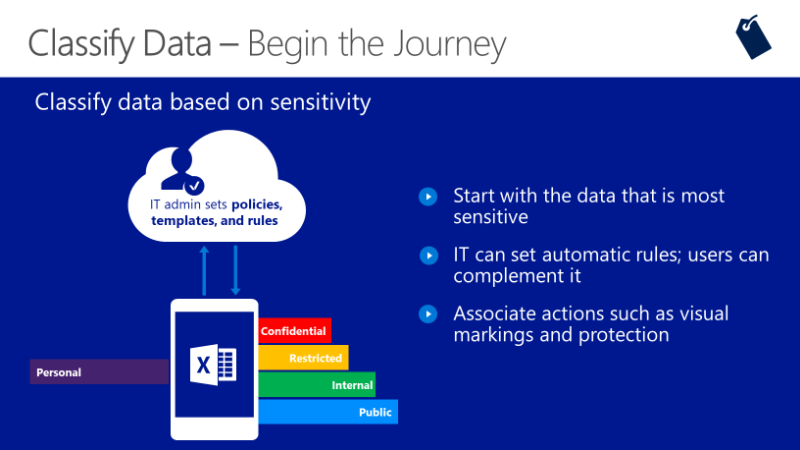

Start the classification journey with your most critical and sensitive data and work your way to the least sensitive data.

If you're unsure of your organization's data classification policies, contact your legal department. Usually they know the data classifications, visual markings, and rules for copying and sharing.

Next, set basic automatic data classification rules and let users complement them. As users classify more files, the better you can expand and refine these automatic rules.

Finally, associate the actions of classifying data and files by adding visual markers and enhanced protection. For example, a file labeled "Classified" would display a watermark of CONFIDENTIAL and encrypt itself.
