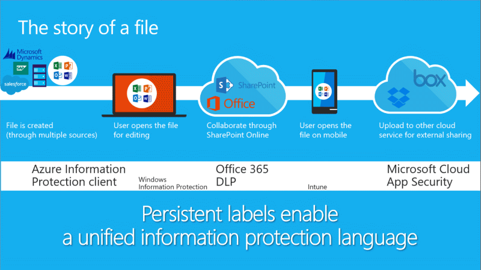

Let's look at the journey of a file and discuss how Microsoft technologies can help protect the data within that file.

#### File is created

- Regardless of where the file is created, sensitivity labeling in Office apps can enforce information protection based on the labels attached to the data.

#### User edits the file

- The label is updated based on the user's changes and the content's sensitivity. This ensures the file has the right protection.

#### User shares the file with another user in the organization

- As an additional layer of protection, Data Loss Prevention (DLP) policies help prevent the accidental or inadvertent sharing of sensitive documents and emails.

#### User opens the file on their phone

- If a user receives and opens the data on a mobile device, Intune enforces protection of the data.

#### User uploads the file to another cloud service such as Dropbox

- If a user uploads the data to other clouds for external sharing, services such as Microsoft Cloud App Security can apply policies based on the data's labels.
