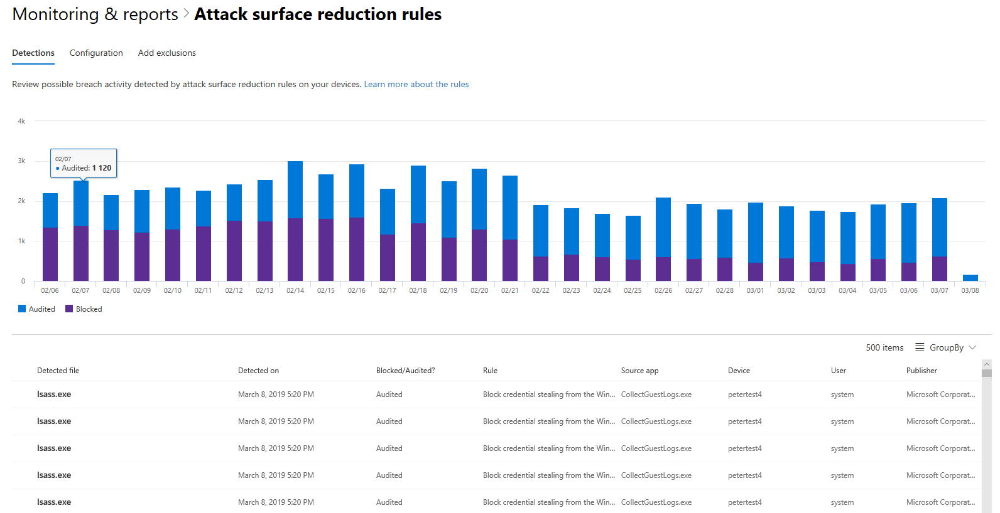

You can use attack surface reduction in the Microsoft 365 Defender portal to help reduce your Windows 10 attack surfaces. Its rules help prevent actions and apps that are typically used by exploit-seeking malware to infect machines. These rules control when and how executables can run. For example, you can prevent JavaScript or VBScript from launching a downloaded executable, block Win32 API calls from Office macros, or block processes that run from USB drives.

:::image type="content" source="../media/asr-threats.png" alt-text="Attack surface reduction threat rules." border="false":::

The **Attack surface reduction rules** card provides an overview of the deployment of rules across your devices.

The top bar on the card shows the total number of devices that are in the following deployment modes:

- **Block mode** – devices with at least one rule configured to block detected activity
- **Audit mode** – devices with no rules set to block detected activity, but has at least one rule set to audit detected activity
- **Off** – devices with all attack surface reduction rules turned off

The lower part of this card shows settings by rule across your devices. Each bar indicates the number of devices that are set to block or audit detection or have the rule completely turned off.

The chart at the top of this screenshot shows a timeline of detections that were  blocked or audited. The table at the bottom lists the most recent detections. Use the following information on the table to understand the nature of the detections:

- **Detected file** – the file, typically a script or document, whose contents triggered the suspected attack activity
- **Rule** – name describing the attack activities the rule is designed to catch
- **Source app** – the application that loaded or executed content triggering the suspected attack activity. This could be a legitimate application, such as web browser, an Office application, or a system tool like PowerShell.
- **Publisher** – the vendor that released the source app

## Learn more

When you're done with a link, use the **Back** arrow in your browser to come back to this page.

- [Attack surface reduction rules](/windows/security/threat-protection/microsoft-defender-atp/attack-surface-reduction#attack-surface-reduction-rules)
