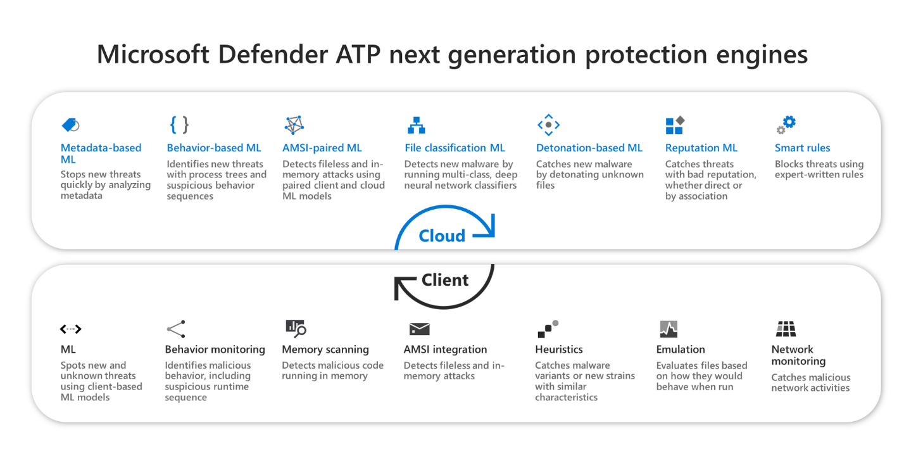

## Windows Defender Antivirus

Microsoft next-gen technologies in Windows Defender Antivirus provide near-instant, automated protection against new and emerging threats. To dynamically identify new threats, these technologies work with large sets of interconnected data in the Microsoft Intelligent Security Graph and powerful artificial intelligence (AI) systems driven by advanced machine learning models.

Windows Defender Antivirus includes:

- Cloud-delivered protection for near-instant detection and blocking of new and emerging threats. Along with machine learning and the Intelligent Security Graph, cloud-delivered protection is part of the next-gen technologies that power Windows Defender Antivirus.
- Always-on scanning, using advanced file and process behavior monitoring and other heuristics (also known as "real-time protection")
- Dedicated protection updates based on machine-learning, human and automated big-data analysis, and in-depth threat resistance research

Always-on protection consists of real-time protection, behavior monitoring, and methods to identify malware based on known suspicious and malicious activities. These activities include events such as processes making unusual changes to existing files, modifying or creating automatic startup registry keys and startup locations (also known as auto-start extensibility points, or ASEPs), and other changes to the file system or file structure.

With cloud-delivered protection, next-gen technologies provide rapid identification of new threats, sometimes even before a single machine is infected.

## Microsoft Defender Application Guard

Designed for Windows 10 and Microsoft Edge, Application Guard helps to isolate enterprise-defined untrusted sites, protecting your company while your employees browse the Internet. As an enterprise administrator, you define what is among trusted web sites, cloud resources, and internal networks. Everything not on your list is considered untrusted.

If an employee goes to an untrusted site through either Microsoft Edge or Internet Explorer, Microsoft Edge opens the site in an isolated Hyper-V-enabled container, which is separate from the host operating system. This container isolation means that if the untrusted site turns out to be malicious, the host PC is protected, and the attacker can't get to your enterprise data.

Application Guard has been created to target several types of systems:

- **Enterprise desktops** These desktops are domain-joined and managed by your organization. Configuration management is primarily done through Microsoft Endpoint Configuration Manager or Microsoft Intune. Employees typically have Standard User privileges and use a high-bandwidth, wired, corporate network.
- **Enterprise mobile laptops** These laptops are domain-joined and managed by your organization. Configuration management is primarily done through Microsoft Endpoint Configuration Manager or Microsoft Intune. Employees typically have Standard User privileges and use a high-bandwidth, wireless, corporate network.
- **Bring your own device (BYOD) mobile laptops** These personal laptops are not domain-joined, but are managed by your organization through tools, such as Microsoft Intune. The employee is typically an admin on the device and uses a high-bandwidth wireless corporate network while at work and a comparable personal network while at home.
- **Personal devices** These personal desktops or mobile laptops are not domain-joined or managed by an organization. The user is an admin on the device and uses a high-bandwidth wireless personal network while at home or a comparable public network while outside.

## Learn more

- [Implement and manage Windows Defender Application Guard](/windows/security/threat-protection/windows-defender-application-guard/wd-app-guard-overview?azure-portal=true)
- [Implement and manage Windows Defender Credential Guard](/windows/security/identity-protection/credential-guard/credential-guard-requirements?azure-portal=true)
- [Implement and manage Windows Defender Exploit Guard](/windows/security/threat-protection/microsoft-defender-atp/configure-attack-surface-reduction?azure-portal=true)
- [Implement Microsoft Defender for Endpoint](/windows/security/threat-protection/microsoft-defender-atp/microsoft-defender-advanced-threat-protection?azure-portal=true)
- [Integrate Windows Defender Application Control](/windows/security/threat-protection/windows-defender-application-control/windows-defender-application-control-deployment-guide?azure-portal=true)	
- [Manage Windows Defender Antivirus](/windows/security/threat-protection/microsoft-defender-antivirus/deploy-manage-report-microsoft-defender-antivirus?azure-portal=true)
