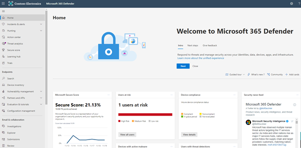
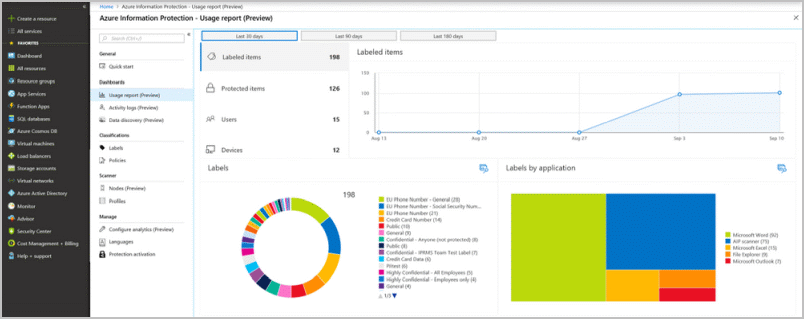
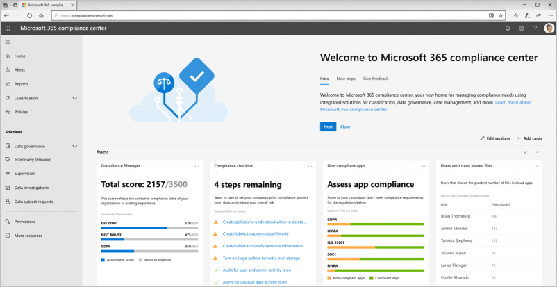

You must understand the state of your sensitive data and how to remediate potential issues. Microsoft information protection technologies offer tools that help you gather information, learn about the state of your sensitive data, and complete your organization's information protection lifecycle.

## Microsoft 365 Defender portal

The Microsoft 365 Defender portal features capabilities for monitoring and managing security across your Microsoft identities, data, devices, apps, and infrastructure. Here you can view the security health of your organization, act to configure devices, users, and apps, and view alerts for suspicious activity. The Microsoft 365 Defender portal helps enable security admins and security operations teams to manage and protect their organization efficiently and effectively.

Microsoft 365 Defender portal includes the following data protection features.

- Security Center Reports inform you about:
  - Users with the most shared files
  - Matches from DLP Policies
  - False positives and overrides of the DLP Polices
  - Integration of third-party DLP Policy matches

- Label Analytics show:
  - How your organization uses retention and sensitivity labels to classify, retain, and protect cloud content.
  - How your organization labels content, including frequently used labels, who's applied them, which emails and files they're applied to, and more.

## Azure Information Protection analytics

Azure Information Protection analytics helps you track adoption of your data classification labels. It also enables you to:

- Monitor labeled and protected documents and emails.
- Identify documents that contain sensitive information.
- Monitor user access to labeled documents and emails, and track document classification changes.
- Identify unprotected documents with sensitive information and offer recommendations to mitigate risk.
- Identify when internal or external users access protected documents and whether they were granted access.

## Microsoft 365 compliance center

Microsoft 365 compliance center allows you to manage your organization's data protection posture. It shows how well your cloud service complies with regulations such as the General Data Protection Regulation (GDPR), Health Insurance Portability and Accountability Act (HIPAA), and the ISO-27001 information security standard. This dashboard links directly to the Cloud App Security Portal, Azure Information Protection (AIP) Analytics, and the Microsoft 365 Defender portal.

The compliance center home page displays the following sections.

- **Assess.** Shows how well your organization is doing with respect to data protection and compliance.
- **Protect.** Contains cards that provide high-level information about labels, data loss prevention, third-party apps in use, shared files, shadow IT apps, and more.
- **Respond.** Surfaces alerts and pending dispositions for review and possible action.

 Other areas of the Microsoft 365 compliance center can help you gain further insights and protect your data.

- **Alerts** to view and resolve alerts
- **Reports** to view data about label usage and retention, DLP policy matches and overrides, shared files, third-party apps in use, and more.
- **Classification** to access your labels, label policies, sensitive information types, and label analytics.
- **Policies** to view alerts and to access your DLP and retention policies.
- **Solutions** contains links to access your organization's compliance solutions. These include:
  - Data governance > dispositions
  - eDiscovery
  - Supervision
  - Data investigations
  - Data subject requests
