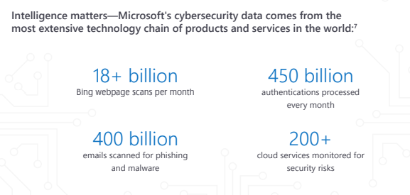

In today’s cyberthreat environment, security teams are up against a constant barrage of attacks. While security teams comb through tens of thousands of cybersecurity alerts—trying to separate legitimate risks from the noise—attacks can slip through unnoticed and do significant damage. There’s too much to handle: the average large organization has to sift through 17,000 malware warnings each week.

In the meantime, while it takes less than 48 hours for attackers to take complete control of a network, the median amount of time it takes an organization to discover a security breach is 99 days.  The average cost of a data breach to a company is $4 million.

But by leveraging advanced security analytics, machine learning, and their own intuition, security experts are fighting back. To dynamically identify new threats, Microsoft technologies such as Windows Defender Antivirus work with large sets of interconnected data in the Microsoft Intelligent Security Graph and powerful artificial intelligence (AI) systems driven by advanced machine learning models. 

The Microsoft Graph Security API is a unified API that provides a standard interface and uniform schema to integrate security alerts and threat intelligence from multiple sources, enriches alerts and data with contextual information, and automates security operations.

The security API is part of the Microsoft Graph, which is a unified REST API for integrating data and intelligence from Microsoft and partner products and services. Using Microsoft Graph, customers and partners can rapidly build solutions that authenticate once and use a single API call to access or act on security insights from multiple security solutions. By exploring other Microsoft Graph entities (such as Office 365, Azure Active Directory, Intune, and more) you can discover additional value and security insights.
