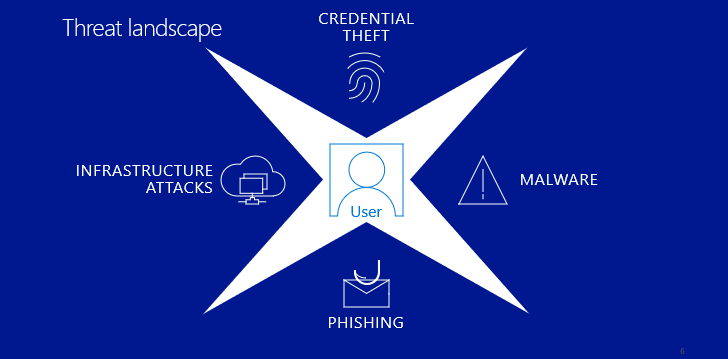
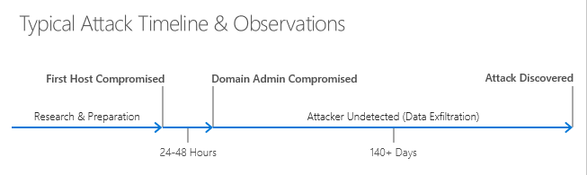

Users today face different types of threats, including commodity-driven threats and advanced human operated attacks. Commodity threats include automated ransomware operations and large-scale phishing campaigns. Advanced human-operated attacks are more complex and typically begin with exploits, brute-force (password guessing) attacks, or tailored phishing emails. While many advanced attacks also use malware to initially infect target computers, they often use undetectable custom components and system tools. They harvest network credentials and remain persistent to collect data over extended periods. 

Targeted attacks usually follow a similar timeline.

- **Research** the target (using social media, open-source intelligence sources, data from previous attacks) and **prepare** for the attack.
- **Attack** using an **elevation of privilege attack** (usually using **credential theft**, but also abuse of administrative and management tools and configuration weaknesses).
- **Exfiltrate data** for illicit purposes, which can go undetected for 200+ days.

This timeline is based on Microsoft’s incident response team’s experience and what’s reported by others in industry. Precise numbers are difficult to determine because evidence of the initial "Patient 0" host is frequently lost after such a long time. Because most attacks are discovered by external parties, variance in discovery times usually depends on the specific industry involved - for example, retail attacks are discovered quickly as credit cards flood the market whereas the loss of intellectual property such as technical designs takes longer to become apparent.