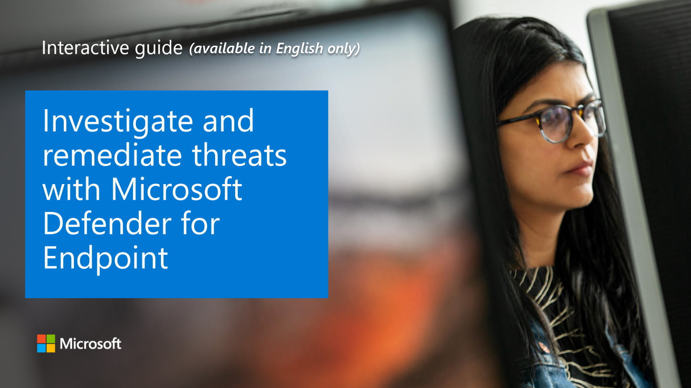

Advanced hunting within Microsoft Defender for Endpoint allows you to hunt for possible threats across your organization using a powerful search and query tool. You can proactively inspect events in your network in order to locate interesting indicators and entities. The flexible access to data aids unconstrained hunting for both known and potential threats.

### Explore how to investigate and remediate threats with Microsoft Defender for Endpoint

View a [video version](https://www.microsoft.com/videoplayer/embed/RE4GfeG) of the interactive guide (captions available in more languages).

<a href="https://mslearn.cloudguides.com/guides/Investigate%20and%20remediate%20threats%20with%20Microsoft%20Defender%20for%20Endpoint"></a>  

Be sure to click the full-screen option in the video player. When you're done, use the **Back** arrow in your browser to come back to this page. 

You can use the same threat-hunting queries to build custom detection rules. These rules run automatically to check for and respond to various events and system states, including suspected breach activity and misconfigured machines.


Advanced hunting is based on the Kusto query language. The following operators are allowed:

- **where**. Filter a table to the subset of rows that satisfy a predicate.
- **summarize**. Produce a table that aggregates the content of the input table.
- **join** Merge the rows of two tables to form a new table by matching values of the specified column(s) from each table.
- **count**. Return the number of records in the input record set.
- **top**. Return the first N records sorted by the specified columns.
- **limit**. Return up to the specified number of rows.
- **project**. Select the columns to include, rename or drop, and insert new computed columns.
- **extend**. Create calculated columns and append them to the result set.
- **makeset()**. Return a dynamic (JSON) array of the set of distinct values that Expr takes in the group.
- **find**. Find rows that match a predicate across a set of tables.

In the screenshot above, the following filters have been written:

- Time filter to review only records from the previous seven days. 
- Filter on the FileName to contain only instances of powershell.exe.
- Filter on the ProcessCommandLine.
- Project only the columns you're interested in exploring and limit the results to 100. 

### Best practices

The following best practices can be followed to ensure query performance:

- Apply filters first - Azure Kusto is highly optimized to utilize time filters.
- Use the **has** keyword over **contains** when looking for full tokens.
- Use **looking in specific column** rather than using full text search across all columns.
- When joining between two tables, choose the table with fewer rows to be the first one (left-most).
- When joining between two tables, project only needed columns from both sides of the join.

Here's an example of a Kusto query for process creation with suspicious file endings:

```kusto
ProcessCreationEvents 
| where EventTime > ago(7d)
| where FileName endswith ".pdf.exe"
    or FileName endswith ".doc.exe"
    or FileName endswith ".docx.exe"
    or FileName endswith ".jpg.exe"
    or FileName endswith ".jpeg.exe"
| project EventTime, ComputerName, FileName, AccountSid, AccountName, AccountDomain
| top 100 by EventTime

```

>
> [!VIDEO https://www.microsoft.com/videoplayer/embed/RE4COn3]
