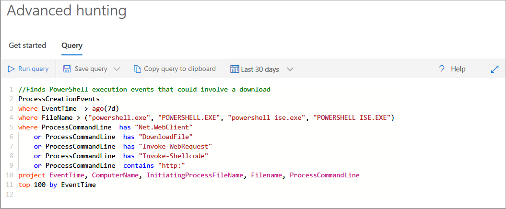

Advanced hunting within Microsoft Defender for Endpoint allows you to hunt for possible threats across your organization using a powerful search and query tool. You can proactively inspect events in your network in order to locate interesting indicators and entities. The flexible access to data aids unconstrained hunting for both known and potential threats.

### Explore how to investigate and remediate threats with Microsoft Defender for Endpoint

You can use threat-hunting queries to build custom detection rules. These rules run automatically to check for and respond to various events and system states, including suspected breach activity and misconfigured machines.

To perform a sample threat-hunting query, in the [Microsoft 365 Defender portal](https://security.microsoft.com), select **Hunting** and then select **Advanced Hunting**. In the query field, type the following example and select Run query:

In the code above, the following filters have been applied:
*    The first `where` returns records from the previous seven days only
*    Filter on the `FileName` to search for process file names representing the PowerShell application
*    Filter on strings in command lines that are typically used to download files using PowerShell
*    Define what the results look like. project returns specific columns, and top limits the number of results to 100

Advanced hunting is based on the Kusto query language. The following operators are allowed:

- `where`. Filter a table to the subset of rows that satisfy a predicate.
- `summarize`. Produce a table that aggregates the content of the input table.
- `join` Merge the rows of two tables to form a new table by matching values of the specified column(s) from each table.
- `count`. Return the number of records in the input record set.
- `top`. Return the first N records sorted by the specified columns.
- `limit`. Return up to the specified number of rows.
- `project`. Select the columns to include, rename or drop, and insert new computed columns.
- `extend`. Create calculated columns and append them to the result set.
- `makeset()`. Return a dynamic (JSON) array of the set of distinct values that Expr takes in the group.
- `find`. Find rows that match a predicate across a set of tables.

### Best practices

The following best practices can be followed to ensure query performance:

- Apply filters first - Azure Kusto is highly optimized to utilize time filters.
- Use the **has** keyword over **contains** when looking for full tokens.
- Use **looking in specific column** rather than using full text search across all columns.
- When joining between two tables, choose the table with fewer rows to be the first one (left-most).
- When joining between two tables, project only needed columns from both sides of the join.
