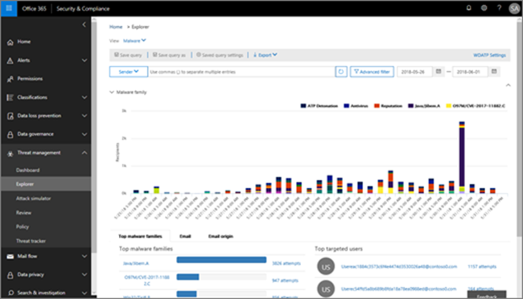

Microsoft Office 365 Advanced Threat Protection (ATP) is a cloud-based email filtering service that helps protect your organization from malware and viruses by providing robust zero-day protection from harmful links in real time. ATP has rich reporting and URL trace capabilities that give administrators insight into specific kinds of attacks.

## Automated remediation
Automated incident response (AIR) capabilities enable you to run automated investigation processes in response to well-known threats.

At a high level, AIR looks like:

|Phase|What's involved
|-|-|
|1|An alert is triggered, and a security playbook is initiated.|
|2|Depending on the particular alert and security playbook, automated investigation begins immediately. (Alternately a security analyst can start an automated investigation manually, from a value in a report such as Explorer.)|
|3|While an automated investigation runs, its scope can increase as new, related alerts are triggered.|
|4|During and after and automated investigation, details, and results are available to view. Results include recommended actions that can be taken to respond and remediate any threats that were found. In addition, a playbook log is available that tracks all investigation activity. If your organization is using a custom reporting solution or a third-party solution, you can us the Office 365 Management Activity API to view information about automated investigations and threats.|
|5|Your security operations team reviews the results and recommendations, and approves remediation actions. In Office 365, remediation actions are taken only upon approval by your organization's security team.|

Explorer is a powerful report that enables your Security Operations team to investigate and respond to threats effectively and efficiently. 

