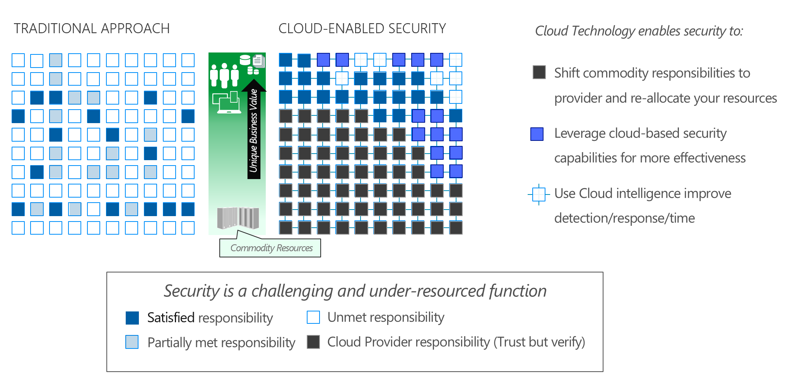

The oldest dilemma facing defenders: As the defender you have to be right every time, everywhere, forever. An attacker just has to be right once.

When we look at the technology stack, there is a spectrum of assets ranging from commodity assets with low intrinsic value to the organization (like storage and computing) all the way up to assets with unique value like data, user accounts, and (to a lesser degree) devices and applications. 

Security is difficult because we never have enough resources to secure all the assets. This reality results in a lot of security projects remaining in the backlog (usually representing accepted risk). 

At the same time, attackers have at their disposal numerous effective techniques that range from exploiting unpatched firmware, operating systems, and apps to configuration weaknesses to human errors by users or administrators. 

The first advantage of the cloud is that it allows you to transfer day to day responsibility for many layers of the stack to the cloud provider. Constant connectivity and resource tracking improvements of cloud technologies let you do more with less resources.

The cloud also makes Threat Detection more effective since the cloud stores and processes massive numbers of events and other threat signals - administrators can use context and machine learning to separate the signal from the noise. 

In addition, the cloud provides a community effect – if 100 customers are protected by cloud threat detection, an investigation of an attack on one benefits the other 99 with little or no effort on their part. 

Finally, large public cloud service providers like Microsoft can invest billions of dollars to get the optimal mix of security expertise, processes, and technologies. Microsoft cloud services can detect and respond to threats in almost real time because we have continuous access to security event information across millions of devices with millions of network connections and logging activities. Microsoft uses behavioral analysis, anomaly detection, and sophisticated statistical algorithms to identify potential compromises as they happen. 
