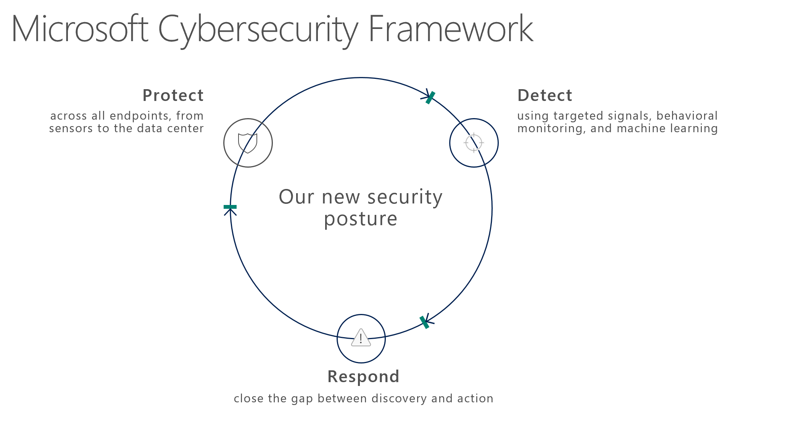

Microsoft’s principles for strategic security include:

- An effective defense requires you to dramatically increase the costs to the attacker.
- Assume your identities are always under attack.
- Apply attack graph thinking.
- Defense in depth is critical.
- Protect, detect, and respond.
- Above all, assume compromise.

## Measuring security success 

**Security Return on Investment** (SROI) is difficult to calculate because both components of risk are difficult to measure.

- **Impact**: Many of the outcomes are unknown and difficult to measure (for example, which competitive products have benefitted from intelligence stolen from your environment?).
- **Likelihood**: This is driven by uncertainty influenced by adaptive/reactive human attacker decisions (that is, they are not random).

**Defender Investment** is composed of:

- Security budget – the cost of purchasing technology and hiring people.
- The time and attention of the team members.

**Defender Return** is composed of your ability to:

- Reduce the attacker’s ROI, which discourages attackers, encouraging them to move on to easier targets, and thereby reduces the frequency of attacks.
- Reduce the business impact of any attack on your organization

**Attacker ROI** is an important factor that defenders must work to influence:

- **Attacker Return** is the success rate of attacks and therefore largely out of the control of individual defenders (for example, black-market availability, law enforcement effectiveness, etc.) so we don’t recommend spending much time or attention on this. 
- **Attacker Investment** is the best opportunity for a defender to affect ROI. By adopting a strategy of defeating the cheapest attack mechanisms, you force an attacker to spend more money/time/resources to successfully attack you. 
