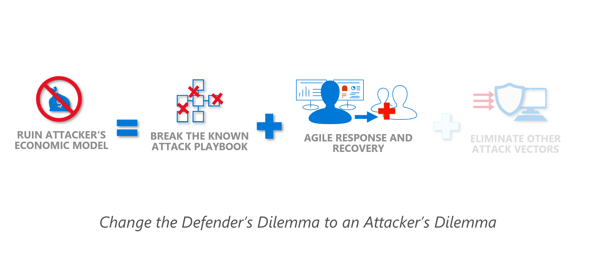

Your focus as a defender should be to undermine the attacker's model by raising the cost of attack. This shifts the current paradigm from a **Defender's dilemma** to an **Attacker's dilemma**.

You must defend against the cheapest attack techniques first. Blocking the cheap attacks raises the cost to attack your environment.

You must also have good detection and response processes and capabilities - these both limit the time attackers have to conduct attacks and the freedom to explore while they are there. These capabilities will also quickly raise the cost to attack your environment

Once you have solid detection and response in place against known attacks, you can start to defend against potential and future attacks.
