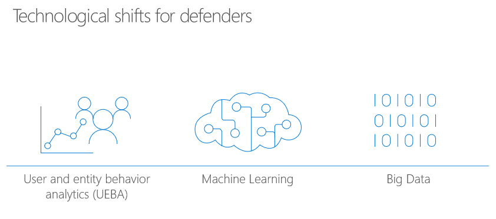

With Office 365 Advanced Threat Protection, you can use Attack Simulator to run realistic attack scenarios in your organization. This can help you identify and find vulnerable users before a real attack impacts your bottom line. 

Three kinds of attack simulations are currently available:
- Display name spear-phishing attack
- Password-spray attack
- Brute-force password attack
