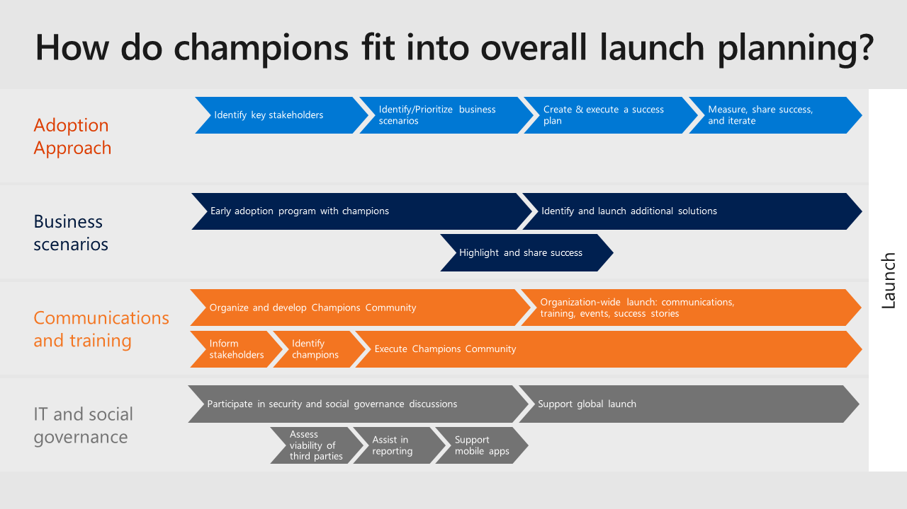

>

Champions are an invaluable resource to drive change and ensure you have meaningful feedback from your employees.  They are an extension of your improvement team, provide peer-to-peer learning, feedback, and enthusiasm to your change project.  

Use the following checklist to create a champions program:

1. Find enthusiastic champions who can commit time and effort.  Look in your IT department, your internal social networks, get recommendations from other "super users," and recruit vocal disrupters so they can put their enthusiasm for change to good use.
2. Build a Microsoft Team for champions to share updates and successes.
3. Provide materials ready to support their work on the group with teams and individuals (for example, brown bag sessions).
4. Ensure a regular rhythm for discussions with the Champions on what's working and what's not.
5. Design a program to engage and recognize their effort, such as providing privileged access to relevant events or speaking engagements.
6. Communicate to individuals about the champions role and where they can be found – remember, they're not an IT support function but business representatives.
7. Incorporate Microsoft's Microsoft 365 training resources and Custom Learning for O365 solution into your own internal training site.
8. Create a contest (like a scavenger hunt or giveaway) between departments to encourage people to interact with Microsoft Teams.
9. Encourage internal champions to sign up for the public [Modern Workplace Teamwork Champion program](https://aka.ms/O365Champions) to continue to build their skills.

| Activity|
|-|
|As a potential Service Adoption Specialist you have an opportunity to learn from others and contribute to a large community of professionals who are also doing this work. First, register, and join the online forum for [Driving Adoption at the Microsoft Technical Community](https://aka.ms/DriveAdoption). Then, join the [Teamwork Champions program](https://aka.ms/O365Champions), which provides free continuing education through monthly calls and online resources. Ensure the leaders of your internal champion program are also signed up for these resources. You can reuse many of the monthly topics and information as a part of your own champion monthly meetings.|
