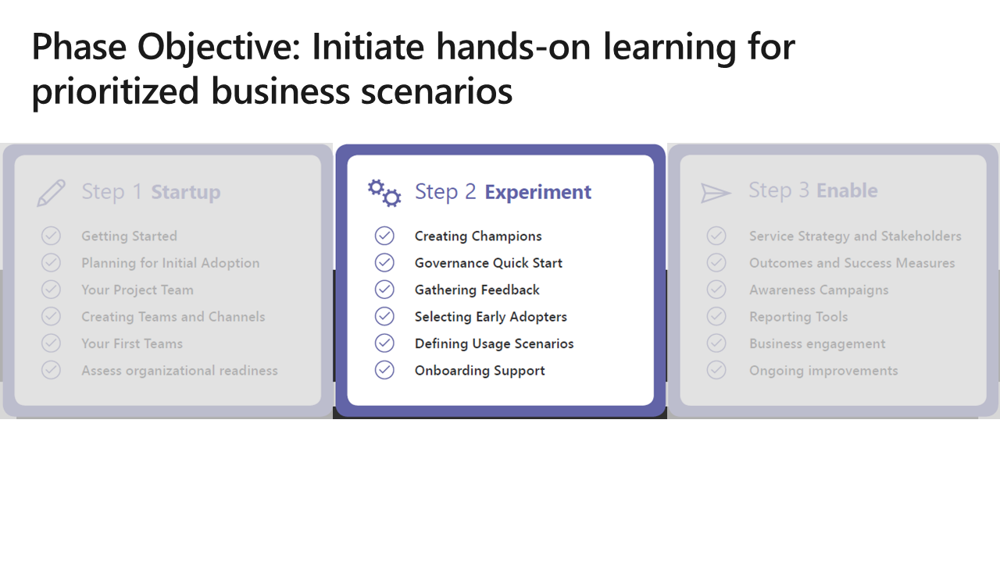
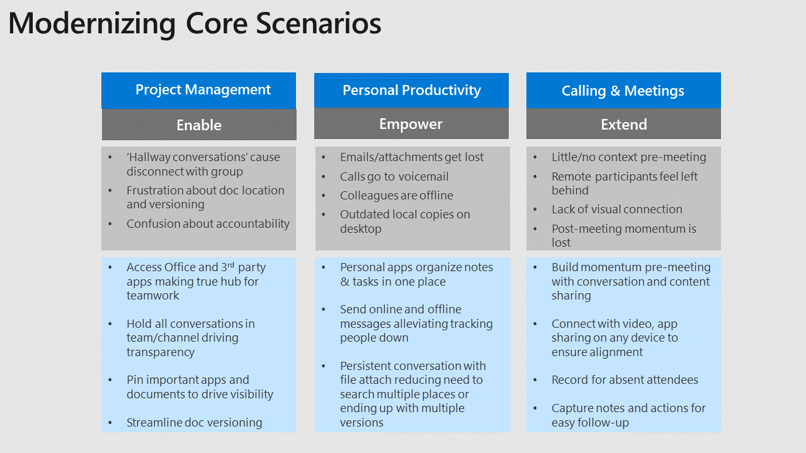

>

Now that you know who's doing what, your organization's capacity for change, and the sentiment of your stakeholders, you're ready to recruit champions and pick the first scenarios to improve. Now is the time to experiment. Your early experiments are designed to:

- Give you hands-on experience with the products
- Test how well your experience design works for your users
- Start building a self-educating user community of champions that will help with the final transition.

You'll also make six key governance decisions and configure your feedback methods to capture valuable data. Use the information you got from speaking to stakeholders, your stakeholder kick-off presentation, and other end-user interviews to start forming a picture of the business processes you want to experiment with.  You can also focus on one of these standard scenarios - they normally need improvement in most organizations:

>

**Project management** - Spreadsheets in multiple versions, random sticky notes, and your memory aren't reliable ways to manage a project. Using Microsoft Teams and Planner can provide a  way to improve project planning in your organization.

**Calling & meetings** - Where are those meeting notes? How can you meet with people in any location? Microsoft Teams provides a modern before-, during-, and after-meeting experience including chat that centralizes knowledge and makes it easy for people who couldn't attend the meeting to see and use the information. Combine online meetings with Planner project management to easily track progress on key projects.

**Personal productivity** - Microsoft Teams and OneDrive provide secure cloud storage for documents, including your OneNote files. This is an invaluable tool for finding and retaining information. With mobile applications, you can access your information wherever you are. Post documents into a Teams channel to share them with the broader team for coauthoring. **STOP E-MAILING THAT SPREADSHEET!**

These are but a few generic examples. Use [this format](https://teamworktools.azurewebsites.net/certassets/SimplifiedScenarioMapping.pptx) along with the [Simplified Persona template](https://teamworktools.azurewebsites.net/certassets/SimplifiedPersonaPainPoints.pptx) to document business scenarios for this phase.
