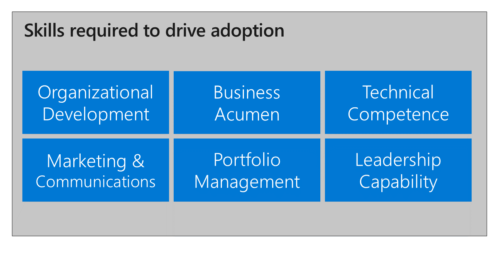
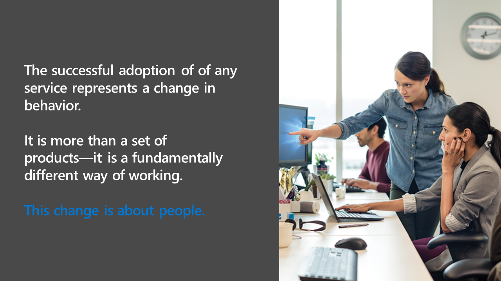
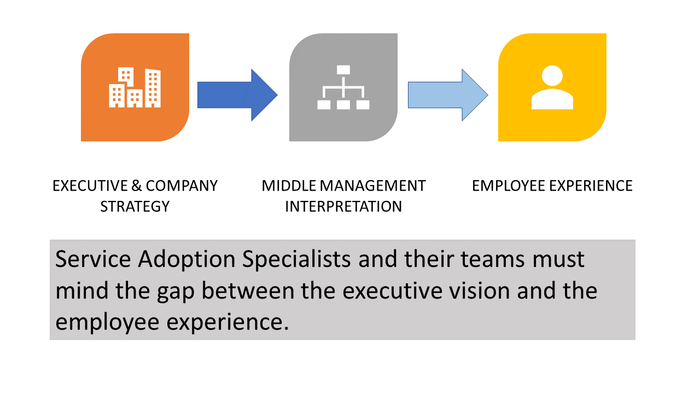
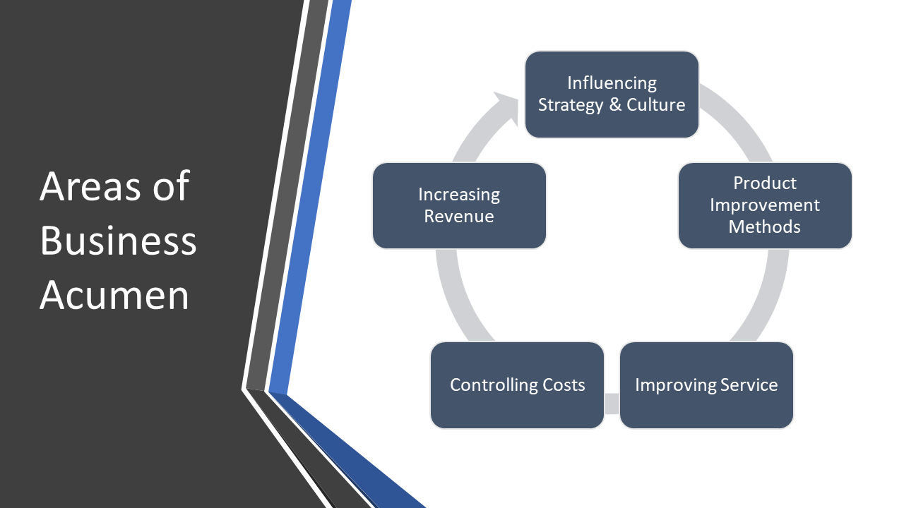
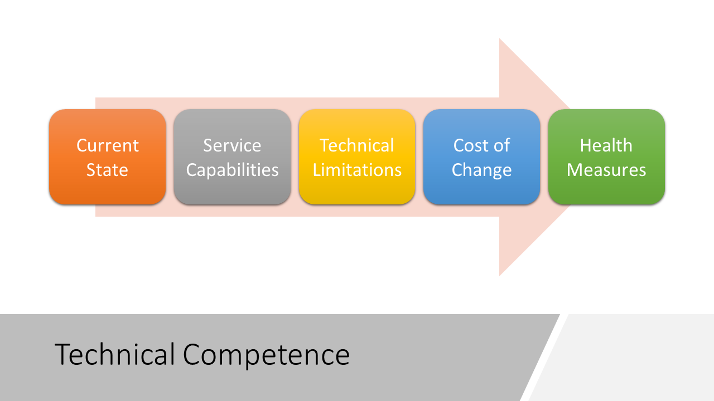
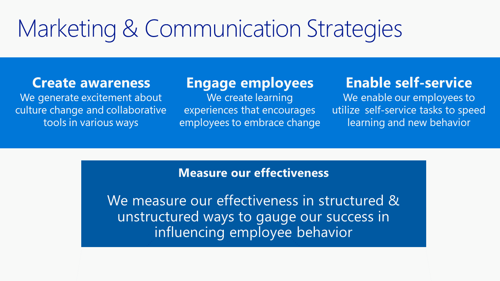
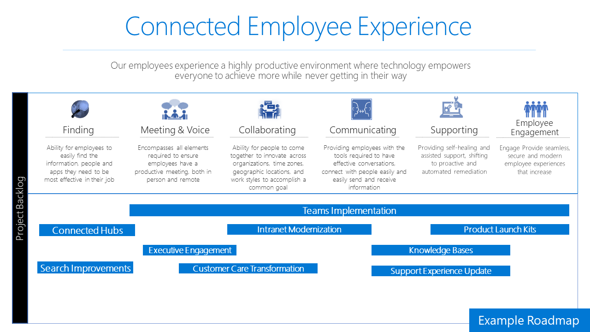

>

*Service adoption* refers to the ability of an organization to drive healthy usage of the business and technical capabilities of a service. *Healthy usage* refers to employees using the service to deliver business outcomes in their organization. Your employees' experience and digital literacy with tools and processes are essential to healthy usage. 

This training highlights the partnership of IT and business. Organizational change management normally focuses on the experience of both the organization and the employee. In service adoption the technical capabilities and their reliability, ease of use, and applicability to employees are an integral part of the process. In successful service adoption both technical and user needs are addressed and integrated into the overall project plan.  

As a service adoption specialist you're at the center of driving human and technical changes to deliver business outcomes. This role has evolved as businesses and technology have increased in pace and complexity. 

There are six knowledge areas we have defined that are required to drive adoption. They are:
- Organizational development
- Business acumen
- Technical competence
- Marketing and Communications
- Portfolio management
- Leadership capability

Mastering each of these areas increases in complexity depending on the size and regional distribution of your organization. 

>[NOTE]
> Before proceeding make sure you've read the Assumptions section of the course introduction. We'll be using these assumptions as we discuss practical application of the knowledge areas above. (Liza note - need this?)

## Knowledge area - Organizational development

>

As a service adoption professional, you're at the nexus of driving organizational and behavioral change for your company. At its heart this change is about people. Centering your project, priorities, and enthusiasm around people can help sustain the energy required to lead this change. 

*Organizational change* is the process an organization must go through to change its strategies, processes, culture, or technologies. Change happens at different paces in a company. Members of the executive suite, given their experience, may adapt to change more readily, especially if they are spurred by competitive pressure. On the other hand, in many organizations, the remote employees, accustomed to solving issues for themselves, most quickly adapt to change. 

What's common knowledge in the executive suite isn't always common to the majority of employees in their day-to-day work. This doesn't mean that individual employees don't care about company strategy or initiatives. In fact, they generally care very much. But sweeping high-level statements from execs often miss what's important to individual employees. Then middle managers, who are often ill-equipped or under too much pressure to deliver results, have to bring out the nuances of communication. It's important to know the baseline knowledge of the employees you are attempting to serve. Assessing their knowledge is a fundamental step to crafting a successful adoption plan and will be discussed further in following modules.

>

As in any relationship listening is the most important skill you'll develop in this role. There's no replacement for empathy when your goal is a superior employee experience. Without listening systems, employee surveys, and conversations over lunch and at the water cooler, you won't have the relevant information to carry out your duties. In your new role you must:

- Bridge the gap between company strategy and day-to-day employee experience
- Be open to feedback of what is and more importantly is not working for employees
- Balance change with business outcomes
- Advocate for the employee experience
- Find and keep your sense of humor

## Knowledge area - Business acumen
>

Many service adoption specialists come from the marketing or communication sides of an organization. This is often because ?they've had success driving change in other areas in the past and are now tasked with a larger initiative. This initiative might not be directly related to technology. Instead they're tasked with product or service improvements and as a result need better technology to deliver on this goal. Those who come from IT backgrounds also have detailed knowledge of the state of the organization and its ability to respond to market changes and customer demands. Whatever your background you need a deep understanding of the strategic, competitive, cultural, and financial needs of your business.

It's essential to understand the imperatives of your company. This is the "connective tissue" between the technology change and the behavioral motivation needed to deliver change. Every organization has goals. Altering the strategy and culture of a company can spur product and service improvements. Every commerical enterprise has to control costs while also increasing revenue. (While these outcomes might not apply to certain not-for-profit or governmental organizations, these organziations have their own initiatives.) 

Developing business acumen is not a one-time activity. It continues over the course of your career. You'll develop skills to address issues with greater complexity. You'll develop these skills by observing business processes, speaking with employees in various roles and at different levels of seniority, and researching your own industry competitors to understand their approach to business transformation. Don't forget that the best teacher is a perceived failure. Often "failures" can spur the greatest transformations when viewed as a learning opportunity.  

The five areas of business acumen are:

1. Influencing company strategy and culture
2. Product improvement methods
3. Improving service
4. Controlling costs
5. Increasing revenue

If you are not familiar with the top initiatives of your organization: STOP! Step away from this training and go find out what is most important to your company. Consider three key perspectives in the following order:

1. Your customers
2. Your employees
3. Your executives

Successful organizations put the customer's needs at the top of the priority list. This should then be balanced with the needs of the employees to deliver on those customer needs. Finally your executives have a vision and specific needs you must weave into the customer and employees' objectives. 

Your ability to execute an adoption program must be steeped in the language, challenges, objectives, and outcomes of your business. There's no substitute for homework in this knowledge area. Your knowledge must be directly applicable to the organization, business unit, or employee role you are attempting to help. 

>### Activity 
>Find a person in your organization who led a 
project that was not viewed as "successful." After validating with them their perspective, ask them what they learned. Make it clear you are there to learn, not to judge their experience. Often you'll find people keen to share their learnings with an interested party. After your conversation, ask yourself these questions:
>- How can this lesson help others?
>- What would I do differently?
>- Could better technology or communication have changed the outcome?
>- Could better technology or communication have changed *the perception* of the outcome?

## Knowledge area - Technical competence

>

Technical competence is the depth of knowledge required to apply specific technology to a business problem to achieve a desired outcome. Without understanding what you can do, how you can do it, and how much it costs, you can't judiciously use technology in your organization. It's critical that you not focus on new features simply because they exist, but instead focus on how you can make your employees' lives easier with the right technology. 

This requires study. If you don't have an IT background don't be daunted by this knowledge pillar. You don't need a computer science degree to achieve the appropriate level of knowledge. What's relevant in this area is hands-on knowledge applicable to the business scenario you are trying to improve. You can also use the partnership of a willing IT professional to help with another important element: the cost of change. 

Technology changes can be expensive far beyond the cost of the hardware or software. Employee training, technical training, configuration and deployment time, updating customer and executive expectations, and ensuring service health and reliability are all components of the cost of change. Take the time needed to understand the new technology and, whenever possible, bring the voice the employee to the table. You also need to balance initial vs long term change costs. For example, building the digital literacy of your employee base using out of the box tools will reduce change costs in the future. Incorporating process changes as you teach the new tools will minimize the disruption of small but frequent incremental changes. 

>### Optional activity 
>Buy yourself a subscription to Office 365. This will give you access to all the administrative tools and workloads that you may use in your work environment. This monthly cost is a small investment in your career and allows you to learn in a safe environment. Alternatively, ask your IT department if they have a "test" or "development" tenant where you can be a user with administrative rights so that you can learn on your own. For many of us there is no alternative to hand-on learning. You can also take advantage of other online Microsoft learning experiences that have lab's attached so you can build out your own solutions. 

## Knowledge area - Marketing and communications
>

Since service adoption is a human centered activity a critical knowledge area is that of marketing and communications. If you cannot communicate why the change is beneficial it will not be possible for you to effectively influence employees to participate. In many IT departments marketing communication specialists are not yet the norm or they are confused with training specialists. These are two very different skills. The marketing communications discipline in the context of service adoption is the effective communication of the why, when, where and how change will occur in a creative and appealing way. The outcome is participation in the change and increased velocity of change throughout the organization. Many employees who typically resist change do so because they have not had it explained to them in terms that are meaningful to their experience. You can change that!

The marketing communications area involves creating awareness of the change, engaging with employees though omni-directional communications, finding useful ways to enable self-service learning and the measurement of the effectiveness of these methods. Remember, communicating is not outbound only! You must effectively setup feedback systems in this area to get information back from employees. This will be data you will use in the service health segments of your plan. These feedback systems include enterprise social networks like Yammer, periodic employee surveys, regular office hours and other online forums for discussions. 

Communications in the context of service adoption does NOT mean sending an email to your employees and making sure they know the help desk extension number! If that is the extent of your communications plan your change plan will encounter severe difficulties. Omni-directional marketing means that multiple communication methods including but not limited to email, posters, events, internal social networks, digital news and all hands meetings must be used simultaneously to communicate the why, what, where and when of change on a regular basis. 

Superior communication can overcome the most difficult of technical and organizational challenges. Visual elements are required to fully leverage a human's ability to learn and retain information quickly! A professionally designed poster is worth a thousand emails!

## Knowledge area - Portfolio management
>

Portfolio management in service adoption is the ability to design and manage and individual improvement project or a portfolio of improvements into a cohesive employee experience roadmap for your organization. It requires all the skills listed in previous sections of this knowledge area list. A roadmap that delivers improvements to the employee experience must balance the needs of customers, measurable business outcomes, technical capabilities and culture to deliver change in the right sized bites for your organization. 

This roadmap is normally crafted in partnership between service adoption specialists and their IT counterparts. It is critical that this roadmap be made in a collaborative manner with stakeholders, executives, success owners and key talent giving input and approval to the vision it will deliver and the speed at which it will become a reality for your employees. 

While you may have been a project or portfolio manager in the past, and I hope you have so risk and issue management is familiar to you, in this context your success is not solely measured by delivering an in scope or on budget project. You will also be measured by the employees whose experience you are changing. Either officially or unofficially their experience of the change and the communication around the change will play a significant role in your success in managing this project or portfolio of improvements. 

For the purposes of the balance of this course we will be assuming you are implementing our example single change project however in the real-world multiple changes are normally occurring at once. Though you may not be directly responsible for all of them you may need to coordinate with other project/portfolio managers in your organization to ensure seamless coordination. 

## Knowledge area - Leadership

>

After reading through the descriptions of each knowledge area we come to the last - leadership. In this role leadership is the ability to inspire a group of people to do things they may have never done before, to bring clarity to the chaos and to hunt down and mediate conflicts and issues as they occur. Leadership through change is the "X" factor and may require the most personal growth from you depending on how you have come to be interested in service adoption. 

The difference in our context is that if you are doing this work appropriately you are delivering beneficial, material change based on data and analysis to a group of individuals who will impact your customers, your market share and the future of your company. What you are doing is change for a cause not for the sake of change. This is a fundamental difference between you and others. You may have been a service champion previously, directly helping employees get the most from technology. You are likely motivated by helping others and I hope you are because that commitment to improving their experience will give you strength exactly when you need your "X" Factor to kick in. 

But the "X" Factor is not an ephemeral thing that only some people are born with. No, not at all. Leadership skills can be developed. Negotiation, conflict resolution, clarifying objectives, financial insight and finding your voice are skills that can be developed. Whether you are auditing this course or intend to embrace this professional discipline we believe that helping you to develop these talents is beneficial to us all. 

It is also important here to mention the "introvert leader". This person has a quieter demeanor. They are not the first or last to speak in a meeting but when they do talk it is worth listening. This personality normally likes to review information ahead of time to have proper time to reflect on it before reacting. There is a great deal of room in our profession for this type of leader. So, if this is you do not feel as though you immediately have to talk more. To the contrary as was mentioned above listening is a critical skill and you may be further ahead in developing that talent than those who are more extroverted and talkative by nature. As in technology, but especially in our area, diversity of style is welcome. Everyone can find a place to be impactful in the service adoption community.