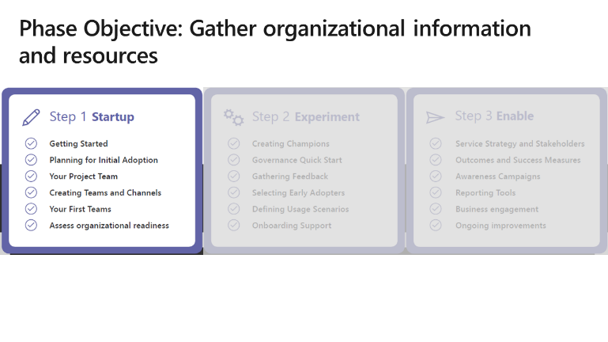
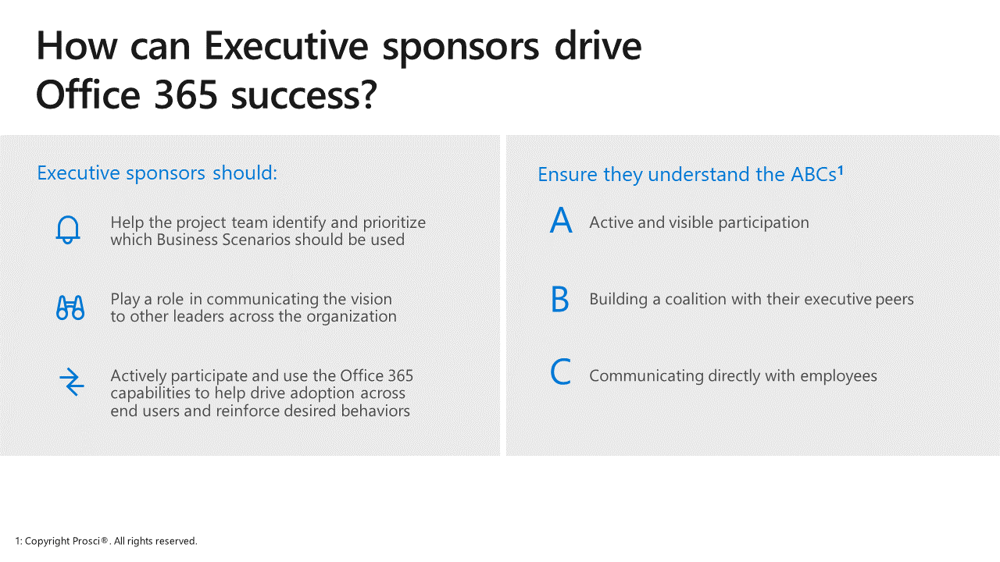
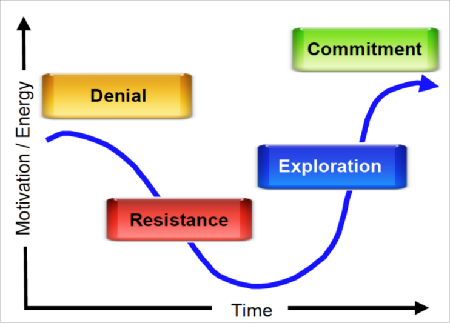

>

You're ready to begin your strategy and project plan. You need to quickly deliver some meaningful results as the overall project budget is not yet set. Realizing that talent is your most important asset first assess the internal resources available to help you accomplish your goals. The following skills and roles are essential to a successful project:

|Role|Description|
|-|-|
|Executive sponsor| Do you have a senior executive in your company that is spearheading the overall business outcomes, including the implementation of Microsoft Teams?| 
|Success owner|Who is accountable for the overall success of your implementation? THis is often a business leader (like the head of product development) in partnership with an IT service owner (like the service manager who owns collaboration and communication services).|
|Project manager|You or another person who has the day-to-day responsibility for managing the overall project, including managing risks, issues, and stakeholders.|
|Champions|Do you have an existing network of champions who provide departmental and 1:1 support for employees during transitions? Do you have a community manager that can provide a consistent presence to these people and handle their training and support?|
|Communications and marketing|Who can help you craft key messages about this change that will resonate with employees? What graphic design assistance do you have?|
|Technical expertise|A deeper understanding of the technical planning, configuration, and deployment of the target software is required. Technical readiness happens in parallel and simultaneously to user adoption planning.|

> [!NOTE]
> With the advent of Microsoft Teams, IT professionals who formerly ran only collaboration or communications/telephony services now need to work together to deliver an integrated experience. In small organizations this may be one individual in larger organization, it's often two or more people.

| Activity|
|-|
|Read [Microsoft Teams Phase One](/microsoftteams/teams-adoption-phase1) for more information on roles and pre-requisites for this phase of your planning.  Watch and use introduction videos like [What is Microsoft Teams?](https://support.office.com/article/video-what-is-microsoft-teams-422bf3aa-9ae8-46f1-83a2-e65720e1a34d) to ensure people begin to understand what this new experience can do. Note that this video doesn't focus on a long list of features but on the outcomes for employees.|

## Key role - the executive sponsor

>

What we know is that most employees aren't willing to use new technology rolled out by their organization. Having an executive sponsor can help. In transformation projects where the CEO was either fairly or very visible, the project was either very successful or extremely successful. A well-defined set of financial and operational targets lead to an "extremely successful" transformation (as shown in various third-party and Microsoft-based research).

Identify and empower your executive sponsor to be a consistently visible part of your change program. This supports sustained use of the new tools and overall transformation. Consistent communications are key. Here are ways your executive sponsors can communicate their support for the project:

- Use Microsoft Teams Live Events to broadcast a digital town hall to employees impacted by the change. Schedule these regularly - preferably monthly or at a minimum quarterly - to reinforce why your organization is going on this change journey.
- Have your executive sponsor use the technology themselves. When executives are present in new experiences, employee use of those experiences increases. Select a relevant executive experience to transform along with other employees. Work with the executive's support staff directly to ensure a smooth transition. 
- Use additional forms of communication including email, intranet articles, and internal social networks to communicate to employees, and allow executives to receive feedback directly. While a more open and transparent culture may be new to your organization, your change program will benefit.

If you don't have a senior executive who is willing to participate, you can drive a portion of change in a grassroots manner. Go directly to a key division or process owner and partner with them on your experimental transformation process. Meaningful business results from this experiment might be what you need to get your C-suite onboard.

## Workstreams and team structures

> [!VIDEO https://www.microsoft.com/videoplayer/embed/RE3Fq2b]

| Activity|
|-|
|Map out your team structures and workstream assignments for your own organization. Take this opportunity to identify talent in your organization or any gaps that need to be filled. It's important to identify missing talent areas early in your planning process so you can get the correct kind of help. Download our Workstream Assignment handout to aid you in this process. |

You can get free service adoption and deployment planning and execution assistance from Microsoft as a part of your Microsoft 365 subscription in a variety of formats through the FastTrack program. Your company may already be working with a technology partner who can also provide this assistance.

Each of the following workstreams and capability areas require a leader, though one person can lead multiple workstreams depending on their workload. For example, one individual can manage the Champion, Early adopter, and Feedback workstreams. If you can't find someone to put next to the workstream, identify it as a risk and discuss it with your success owner or executive sponsor during your regularly scheduled project meetings.

- Service strategy and project plan
- Stakeholder mapping and alignments
- Program communications and success stories
- Champion program
- Support readiness
- Early adopters and feedback
- Governance and security
- Technical readiness and alignment
- Metrics and reporting
- Business process mapping
- Awareness campaign
- Training program
- Service health reviews and improvement planning

### Example activity for Contoso

Map out the capabilities you will need to successfully deliver a Microsoft Teams implementation. You're already working with your IT service manager who is reviewing SuccessWithTeams.com content to manage the technical readiness. You meet and discuss timelines and outcomes and jointly review the workstreams shown above. You both determine that neither of you have the bandwidth to handle the Champion and Early adopter programs or to ensure quality and support readiness. You should undertake one or all of the following actions:

- You have an [eligible license agreement](/microsoftteams/office-365-licensing) with over 150 seats. Reach out to the [Microsoft FastTrack team](https://www.microsoft.com/fasttrack). Your IT administrator can also request help through the **Get Help** widget in the Microsoft 365 admin center. FastTrack engineers and program managers will reach out to help answer your technical questions and create a success plan for Microsoft Teams. 
- To learn from other people who are also driving adoption of Microsoft Teams visit the [Driving Adoption](https://aka.ms/DriveAdoption) forum on the Microsoft Technical Community.
- If you have a technology partner that's already helping you in your company, speak with them about their Microsoft Teams experience to determine if they are qualified to assist you.

Through FastTrack, community forums, and your other business relationships you can find additional Microsoft Certified Partners to assist you in this work.

> [!NOTE]
> If you don't already have an active relationship with your IT service manager, reach out to them and start a conversation about partnering on this project. Be open to their feedback and emphasize that you are focused on the end-user adoption portion of the roll out and want to help ensure employee satisfaction with the service they are working hard to deliver. Having this conversation over lunch never hurts when you're building this important relationship.

## Understanding the change curve

>

In any change program, it's important to understand the basic change curve that applies to all people. Whether personal or professional this structure applies. This training is focused on professional examples, but think about how change has happened in your own life and how you've responded to it. This helps you have empathy and compassion for those who are more resistant to change than may make you comfortable.

**Denial** - Many people consciously or subconsciously deny that change needs to occur. They're comfortable doing things the way they always have. Consider that in your awareness campaigns and executive communications - you must inform people how this change will benefit them and the company. It's often effective to tailor messages to the audience you are talking to. Don't shy away from discussing the most basic of motivations with your employees in positive terms.

**Resistance** - People will hear your message the first time but often continue to actively or passively resist change. Use outreach strategies to engage with resistance - for example, set up breakfast or lunch meetings with food, reward early adopters with recognition, or show how useful meaningful change can be with early adopter case studies. Encourage direct feedback at these events to mine for conflict and program challenges. Start the conversation by pointing out difficulties you had with making the change while facilitating the conversation toward positive suggestions and away from a complaint session.

**Exploration** - When you've influenced your target audience enough, they'll begin to explore. This is a delicate time and a good time to use your champions. Champions can create a favorable experience of the new behavior. Barriers to entry, friction in the experience, or unreliable tools and help can pop your employees right back into the resistance phase. It's also worth mentioning that while younger workers may explore a new technology experience more quickly, older workers between the ages of 55 and 74 have the highest opinion of teamwork (according to a [Gartner study](https://www.gartner.com/en/newsroom/press-releases/2018-06-20-gartner-says-too-few-organizations-have-the-digital-dexterity-to-adopt-new-ways-of-work-solutions)). They're the second most likely demographic to try the new experience you're designing.

**Commitment** - Your employees have now had a positive experience and been rewarded for it. They're committed to continuing with the new behavior but only if it continues to serve their needs. Each day the employee participates in the new behavior you can either reinforce the change or have people revert from a poorly operating experience. Traditional IT goals like resilience, up-time, performance, and security are essential to deliver on your overall business goals.

### Activity for Contoso

You need to get more data about your organization to craft your end-user adoption plan. It's especially important that you understand the needs of your remote sales workers and people in offices in other regions. Use Forms or another survey tool to send out questions before you launch your early adopter pilot. This information will help you prioritize the different issues each user persona may have. Download our [Sample User Survey spreadsheet](https://teamworktools.azurewebsites.net/certassets/Sample_User_Satisfaction_Surveys.xlsx) to get ideas for questions, but make sure you transfer these questions into Microsoft 365 for easy distribution and analysis.

>[!NOTE]
> Make sure you ask your employees if you can contact them for further information. For those who opt, in select several users in key demographics (region, role, user profile) to interview in person or through video chat. Vocal contributors may be candidates for your early adopter or champion programs. In user interviews try to ask open-ended questions and not form the employee's opinion for them. For example, ask, "Can you tell me more about your collaboration experience?"
