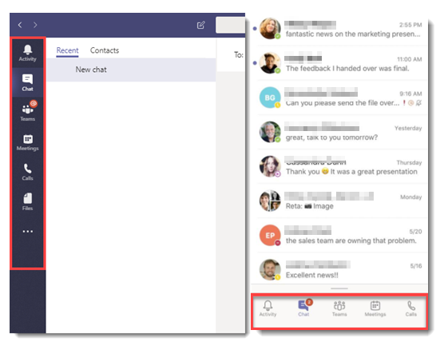
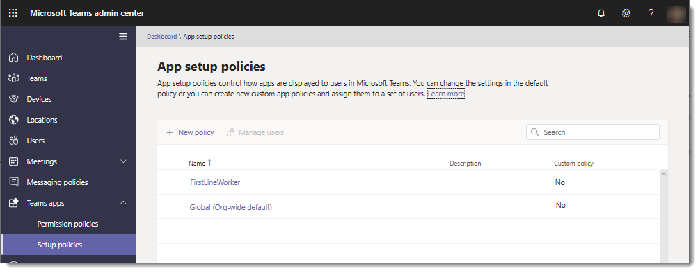

In **Teams apps** in the Microsoft Teams admin center, you can set policies to manage apps for your organization. For example, you can set policies to customize Teams by pinning the apps that are most important to your users.

## Configure app policies

As an administrator, you can use app setup policies in the Teams admin center to customize the app experience for your users. You choose the apps that you want to pin to the app bar in the Teams clients and the order in which they appear on web, desktop, and mobile clients. App setup policies let you showcase apps that users in your organization need, including those built by third parties or by developers in your organization. You can also use app setup policies to manage how built-in features appear.

Apps are pinned to the app bar. This is the bar on the side of the Teams desktop client and at the bottom of the Teams mobile clients (iOS and Android).

Here are some examples of how you can use app policies:

- Drive awareness and adoption of core apps. For example, pin a custom recruiting and talent management app for users on your HR team.
- Selectively pin core Teams features, such as Chat, Teams, and Calling. Doing so can help ensure users are engaged in specific activities within Teams.

## Customize app availability and prominence

You manage app setup policies in the Microsoft Teams admin center. You can use the global (org-wide default) policy or create custom policies and assign them to users. Users in your organization will automatically get the global policy unless you create and assign a custom policy.

You can edit the settings in the global policy to include the apps that you want. If you want to customize Teams for different groups of users in your organization, you can create and assign one or more custom policies. If a user is assigned a custom policy, that policy applies to the user. If a user isn't assigned a custom policy, the global policy applies. You can also assign a custom setup policy to multiple users that you've already identified, such as all users in a security group.

## Customize tabs

Tabs allow team members to access services and content in a dedicated space within a channel or in a chat. This lets the team work directly with, and have conversations about, tools and data, all within the context of the channel or chat. Owners and team members can add tabs to a channel, private chat, and group chat to help integrate their cloud services. Tabs can be added to help users easily access and manage the data they need or interact with the most.

In addition to the built-in tabs, you can design and develop your own tabs to integrate into Teams or share with the rest of the community. You can control access to your custom tabs by configuring the appropriate Microsoft 365 Groups.

The Microsoft Developer Network provides sample tabs developed by Microsoft that you can download, and detailed instructions for designing and building your own tabs.

## Learn more

When you're done with a link, use the **Back** arrow in your browser to come back to this page.

- [Admin settings for apps in Microsoft Teams](/microsoftteams/admin-settings)
- [Use built-in and custom tabs in Microsoft Teams](/microsoftteams/built-in-custom-tabs)
