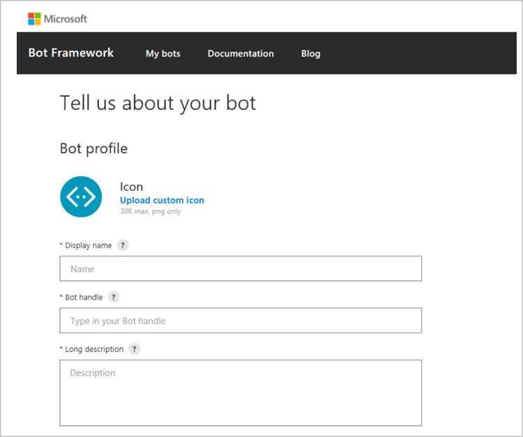

Bots are automated programs that respond to queries or give updates and notifications, such as a welcome message to a new team member. Bots let users interact with cloud services like task management, scheduling, and polling in a Teams chat. Bots are supported in private chats, group chats, and channels within a team. Administrators can control whether the use of bots is allowed in an Office 365 implementation.

## Create custom bots for Microsoft Teams

Bots developed by the community can be used within Teams. The bot's functionality and the ability to upload custom apps (also known as sideloading) needs to be enabled at the Office 365 tenant level. 

You can create a bot that integrates into your business applications, using the **Microsoft Bot Framework**. If you require your users to sign in before using the bot, this will make sure only your employees can access it, even if its application ID becomes known.

