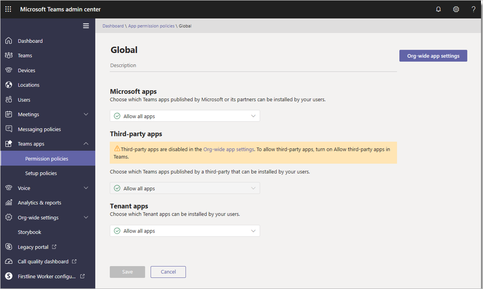

Teams provides a great out-of-the-box collaboration experience for your organization, and most organizations find that the default settings for apps work for them. Still, you may want to change some of the default settings to accommodate your organization's business requirements:

- **Apps availability**. Teams provides apps published by Microsoft and by third parties. These apps engage users, support productivity, and integrate commonly used business services. You get apps from the Teams Store. By default all apps, including custom apps, are turned on for all users. You can turn any apps on or off for your entire organization.
- **Apps permissions**. Apps are consented to by users and managed by the admin or IT pro through policies. However, usually an app's permissions and risk profile are defined in the app itself.
- **App templates**. These production-ready apps for Microsoft Teams are community driven, open-source, and available on GitHub. Each contains detailed instructions for deploying and installing it.

## Learn more

When you're done with a link, use the **Back** arrow in your browser to come back to this page.

- [Overview of apps in Teams](https://support.office.com/article/overview-of-apps-in-teams-747492ee-7cdd-4115-a993-8c7e7f98a3d0)
- [Apps, bots, and connectors in Microsoft Teams](/microsoftteams/deploy-apps-microsoft-teams-landing-page)
