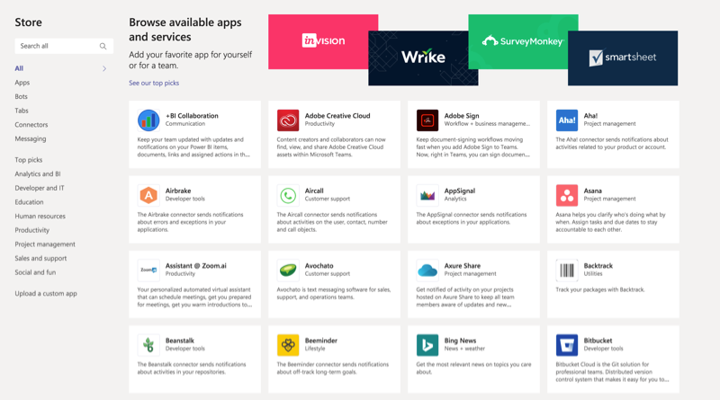

Microsoft Teams apps provide out-of-the-box tools for your organization to get more out of Teams. These apps combine the functionality of tabs, messaging extensions, connectors, and bots provided by Microsoft, built by a third party, or by developers in your organization.

Apps are a way to aggregate one or more capabilities into a package that can be installed, upgraded, and uninstalled. The capabilities include:

- Bots
- Messaging extensions
- Tabs
- Connectors

Apps let you find content from your favorite services and share it right in Teams. They help you do things such as pin services at the top of a channel, chat with bots, or share and assign tasks. We recommend that you include our featured apps - such as Planner - in your initial Teams rollout. Add other apps, bots, and connectors as you drive Teams adoption.

## Interact with apps and services

There are several ways you can interact with apps and services in Teams:

- **Chat with a bot**. Bots provide answers, updates, and assistance in a channel. You can chat with them one-on-one or in a channel. They can help with task management, scheduling, and more.
- **Share content on a tab**. Tabs help you share content and functionality from your favorite services in a channel. They can connect you to Microsoft services (like Excel or SharePoint), other services (like Asana, YouTube, and Zendesk), or to a website of your choice.

> [!NOTE]
> Tabs in channels can be seen by everyone on the team. Tabs in chats can only be seen by the people in that chat.

- **Get updates from a connector**. Connectors send updates and information directly to a channel. Get automatic updates from your favorite services like Trello, JIRA, Twitter, RSS feeds, GitHub, and more.
- **Add rich content to your messages**. These apps find content from different services and send it straight to a message. You can share things like weather reports, daily news, images, and videos with anyone you're talking to. Messages sometimes include buttons for interacting with the app. For example, a daily weather report could include an option to download the forecast for the entire week.

