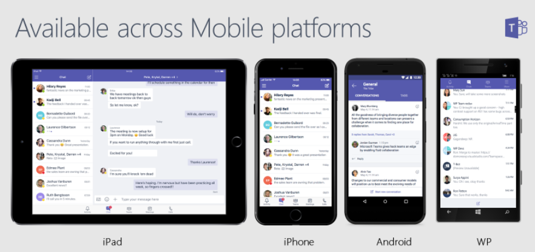

The Microsoft Teams mobile apps are available for Android (4.4 or later) and iOS (10.0 or later). They are geared to on-the-go users participating in chat-based conversations, allowing peer-to-peer audio calls. 

Mobile apps can be installed from the Google Play or Apple App Store. The mobile client isn't available through MDM (mobile device management) and can’t be side-loaded.

When planning to deploy the Teams mobile client for your organization, consider any restrictions that could prevent your users from installing the mobile client. For example, if your organization restricts software installation, make sure the process is compatible with Microsoft Teams.
