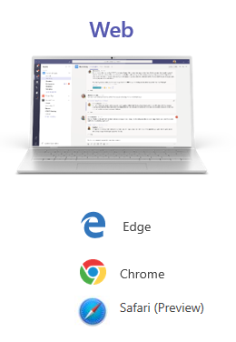

The Microsoft Teams web client is a fully functional client that runs on the most recent versions of all common browsers. The web client supports Calling and Meetings by using webRTC, so Teams requires no plug-in or download to run in a web browser. The browser must be configured to allow third-party cookies.

As long as an operating system can run the supported browser, Teams is supported.

The web client performs browser version detection upon connecting to Teams. If an unsupported browser version is detected, Teams blocks access to the web interface. It then recommends the user downloads the desktop client or mobile app.

The Teams web app is updated weekly.

## Learn more

When you're done with a link, use the **Back** arrow in your browser to come back to this page.

- [Teams supported browsers](/microsoftteams/limits-specifications-teams#browsers)
