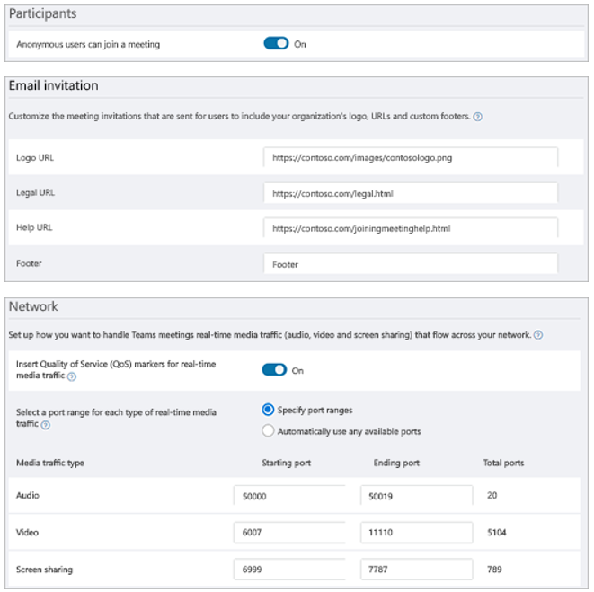

Teams meeting settings apply to all Teams meetings. You manage these settings from the Microsoft Teams admin center.

You use meeting settings to:

- Control whether anonymous users can join Teams meetings.
- Customize meeting invitations.
- Customize settings to handle real-time media traffic.
- Set port ranges for real-time media traffic.

## Learn more

When you're done with a link, use the **Back** arrow in your browser to come back to this page.

- [Manage meeting settings in Microsoft Teams](https://docs.microsoft.com/microsoftteams/meeting-settings-in-teams)
