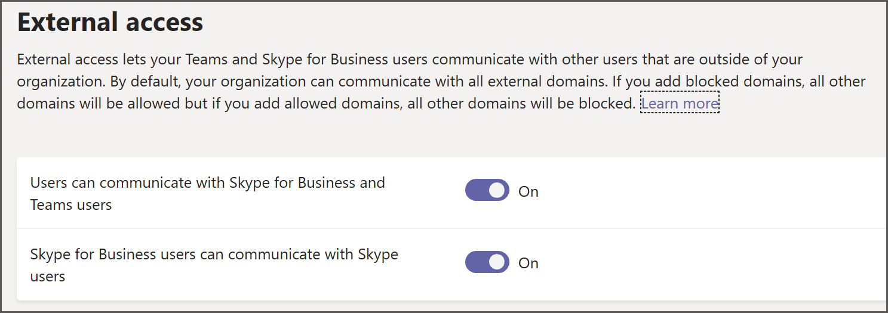

With Microsoft Teams external access—also known as federation—Teams users from other domains can participate in your chats and calls. You can also allow other external users who are still using Skype for Business Online, Skype for Business on-prem, or even Skype to participate. Unlike guest access, with external access the chat participants have no access to the inviting organization’s teams or team resources but can only participate in one-on-one federated chat. Tenant administrators can choose between the two communication options depending on which level of collaboration is desirable with the external party.

## When to use external access (federation)

Consider using external access when:

- You have users in different domains in your business.
- You want the people in your organization to use Teams to contact people in specific businesses outside of your organization.
- You want any Teams user worldwide to be able to find and contact you, using your email address.

## How does external access differ from guest access?

External access and guest access are different in several important ways, as detailed in the following table.

|  | External access |Guest access  |
|---|---|---|
| Gives access permission to an individual |  | x |
| Gives access permission to an entire domain | x |  |
| Gives access to teams and channels |  | x |
| Allows users to find, call, and send instant messages |x  |  |
| Allows users to set up meetings with members of a Teams organization | x |  |
| Allows users to access resources, such as channel discussions and files, for a specific team |  | x |
| Allows users to chat with other users in the team they’ve been invited to|  | x |
| Allows users to participate in one-on-one federated chat| x |  |

## Configure external access in Teams admin center

You can easily set up external access for your organization by using the Teams Admin center. There are three scenarios for setting it up:

- **Scenario 1.** You can use **Open Federation**. This is the default setting, and it lets people in your organization find, call, and send IM/Chats as well as set up meetings with people external to your organization. When you use this setup, your users can communicate with all external domains that are running Teams or Skype for Business and are using Open Federation or have added your domain to the **Allow** list.
- **Scenario 2.** You can add a domain or domains to the **Allow** list. It's important to know that if you do this it will **Block** all other domains.
- **Scenario 3.** You can add a domain or domains to the **Block** list. Be aware that if you do this it will **Allow** all other domains.

