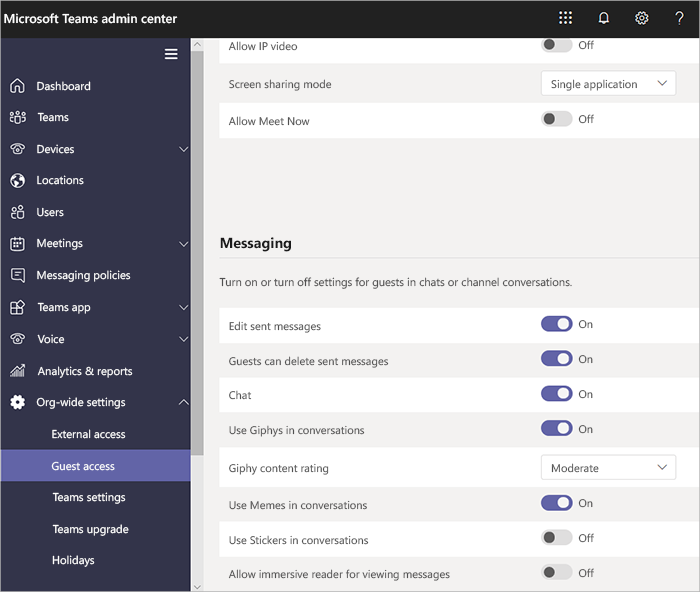
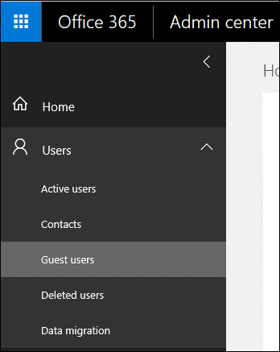

You can grant guest access to teams and channels within your Microsoft Teams organization in order to collaborate with people outside your organization. Anyone with an Azure Active Directory (Azure AD) account or a consumer email account such as Outlook or Gmail can participate as a guest in Teams with full access to team chats, meetings, and files.

Note that guest access differs from external access. Guest access applies to an individual, while external access applies to an entire domain. Administrators can choose either approaches or both, depending on their organizational needs, but we recommend enabling guest access for a fuller, collaborative Teams experience.

Guest access, once granted by a team owner, allows a guest to access resources, such as channel discussions and files, for a specific team, and chat with other users in the team they have been invited to. With external access (federated chat), the external chat participants have no access to the inviting organization’s teams or team resources. They can only participate in one-on-one federated chat. Tenant administrators can choose between the two communication options depending on which level of collaboration is desirable with the external party.

Guest access is a tenant-level setting in Teams that is turned off by default. When guest access is turned on, everyone in your organization can add guest users to an Office 365 Group. The guests will have access to all Office 365 Group features. Guest access is included with many Office 365 subscriptions with no additional licensing requirement. Be aware that guest access is subject to Azure AD and Office 365 service limits.

## Who is a guest?

A guest is someone who isn't an employee, student, or member of your organization; for example, partners, vendors, suppliers, or consultants. Anyone with a business account (Azure AD) or consumer email account (Outlook, Gmail, or others) can participate as a guest in Teams, with full access to teams and channel experiences.  All guests in Teams are covered by the same compliance and auditing protection as the rest of Office 365 and can be managed securely within Azure AD.

## Guest authorization levels

You can manage Teams guest access features and capabilities through four different levels of authorization. All the authorization levels apply to your Office 365 tenant. Each authorization level controls the guest experience as follows:

- **Azure Active Directory.** Guest access in Microsoft Teams relies on the Azure AD business-to-business (B2B) platform. This authorization level controls the guest experience at the directory, tenant, and application level.
- **Microsoft Teams.** Controls the guest experience in Microsoft Teams only.
- **Office 365 Groups.** Controls the guest experience in Office 365 Groups and Microsoft Teams.
- **SharePoint Online and OneDrive for Business.** Controls the guest experience in SharePoint Online, OneDrive for Business, Office 365 Groups, and Microsoft Teams.

These different authorization levels give you flexibility in how you set up guest access for your organization. For example, if you don’t want to allow guest users in Teams but want to allow it overall in your organization, just turn off guest access in Teams.

The following diagram shows how guest access authorization dependency is granted and integrated between Azure AD, Microsoft Teams, and Office 365.

## Manage guest access in the Teams admin center

Administrators can add guests at the tenant level, set and manage guest user policies and permissions, and pull reports on guest user activity by using the Teams admin center. Guest user content and activities are under the same compliance and auditing protection as the rest of Office 365.

Team owners can invite new guests and add existing directory guest users to their teams. Team owners can identify guest users via **Teams > Manage teams**, and set channel-related capabilities for guests via **Org-wide settings > Guest access**, including allowing guests to create, update, and delete channels, as shown in the following illustration.

## Manage guest access in Azure AD

Administrators can use Azure AD to determine whether external collaborators can be invited into your tenant as guests, and in what ways. The settings for invitations apply at the tenant level and control the guest experience at the directory, tenant, and application levels.

Azure AD includes the following settings to configure external users:

- Guest user permissions are limited (Yes/No).
- Administrators and users in the guest inviter role can invite (Yes/No).
- Members can invite (Yes/No).
- Guests can invite (Yes/No).

## Manage guest access in the Office 365 Admin center

Administrators can control whether to allow guest access to Office 365 Groups for their whole organization or for individual Office 365 groups. They can also control who can allow guests to be added to groups.

You can use the Office 365 Admin center to perform the following management tasks:

- View guest users.
- Add existing guests to an Office 365 Group.
- Turn on or off guest access to group files and OneNote.
- Turn on or off the Sharing option.
- Manage who can add guest users.
- Log and monitor guest access users.
- Remove guest access.

