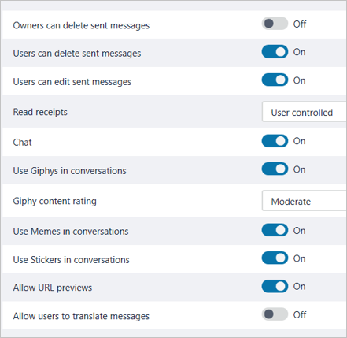

Messaging policies are used to control which chat and channel messaging features are available to users in Microsoft Teams. You can use the default policy that is created automatically, or create one or more custom messaging policies for people in your organization. After you create a policy, you can assign it to a user or group of users.

## Change or create a messaging policy for one or many users

You can manage messaging policies in the Teams admin center by signing in with administrator credentials and choosing **Messaging policies** in the left navigation pane.

- To edit the existing default messaging policy for your organization, you would select the default policy called **Global,** and then make your changes.
- To create a new custom messaging policy, you would:

1. Select **New policy.**
1. Give the new policy a name.
1. Turn on or off relevant settings.
1. Assign your policy to users.
1. Save the new policy.

NOTE
You can't delete a policy if users are assigned to it. You must first assign a different policy to all affected users before deleting the original policy.

## Messaging policy settings

The following settings can be turned on or off, or configured, for the global messaging policy or a new custom policy.

- If owners can delete sent messages.
- If users can delete sent messages.
- If users can edit sent messages.
- How read receipts are controlled, by the user or on/off for everyone.
- If chat can be used.
- If giphys are used in conversations.
- How giphy content rating can be configured.
- If memes are used in conversations.
- If stickers are used in conversations.
- If URL previews are allowed.
- If users can translate messages.
- If immersive reader is allowed for viewing messages.
- If users can send priority notifications.
- Whether voice message creation is allowed.
- On mobile devices, whether favorite channels are displayed above recent chats.
- If a user is allowed to remove users from a group chat.

