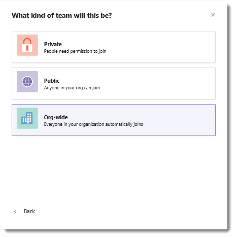

Creating an organization-wide team enables everyone in a small to medium-sized organization to be a part of a single team for ease of collaboration. With org-wide teams, global administrators can easily create a public team that pulls in every user in the organization and keeps the membership up to date with Active Directory as users join and leave the organization.

When you create an org-wide team, all global administrators are added as team owners and all active users are added as team members, including unlicensed users. The first time an unlicensed user signs into Teams, the user is assigned a Microsoft Teams Commercial Cloud trial license.

> [!IMPORTANT]
> Only global admins can create org-wide teams and currently an org-wide team is limited to organizations with no more than 5,000 users. There’s also a limit of five org-wide teams per tenant. If these requirements are met, global admins will see **Org-wide** as an option when they select **Build a team from scratch** when creating a team.

## Create an organization-wide team

Global admins can create an org-wide team by using the Teams client.

As your organization's directory is updated to include new active users, or if users no longer work at your company and their Teams license is disabled, changes are automatically synced and the users are added or removed from the team. Team members can't leave an org-wide team. As a team owner, you can manually add or remove users if needed.

## Best practices for creating an org-wide team

To get the most benefit out of your org-wide team, team owners should follow these best practices:

- Allow only team owners to post to the General channel, to reduce channel *noise.*
- Turn off @team and @[team name] mentions to prevent overloading the entire organization.
- Automatically mark important channels as favorites to ensure that everyone in your organization engages in specific conversations.
- Set up channel moderation so that moderators can control who can start a new post in a channel, add and remove moderators, control whether team members can reply to existing channel messages, and control whether bots and connectors can submit channel messages.
- Remove accounts that might not belong. Make sure that you use Teams to remove users from your org-wide team. If you use another way to remove a user, such as the Microsoft 365 admin center or from a group in Outlook, the user might be inadvertently added back to the org-wide team.