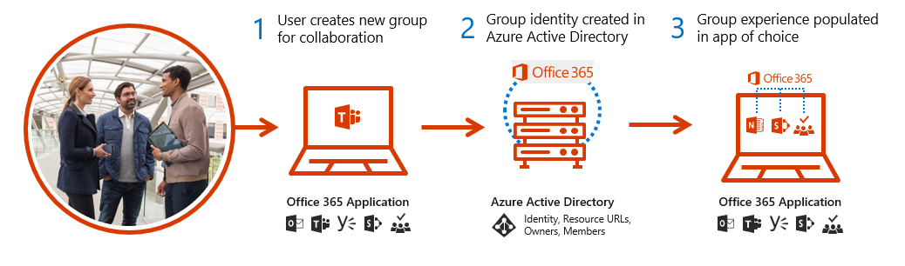

When you create a team in Microsoft Teams, on the back end, you're creating a Microsoft 365 Group and the associated SharePoint document library and OneNote notebook, along with ties into other Microsoft 365 cloud applications.

If the creator of a team is an owner of an existing public or private group, they can add Teams functionality to the group if it has fewer than 5,000 people and has never been added to Teams. This creates one default General channel in which chat messages, documents, OneNote, and other objects reside.

Members of Microsoft 365 Groups fall into three roles:

- **Owners** can perform administrative tasks such as adding or removing group members and changing group settings.
- **Members** are regular users who collaborate within a group.
- **Guests** are participants from outside your organization who've been granted access to the group by an administrator.

You can add or remove team members and perform other team-management tasks within the Teams client itself, or outside Teams by using the Microsoft 365 admin center, Microsoft Azure Active Directory (Azure AD), or the Microsoft Teams PowerShell module.

## Learn more

When you're done with a link, use the **Back** arrow in your browser to come back to this page.

- [Microsoft 365 Groups and Microsoft Teams](/microsoftteams/office-365-groups)
