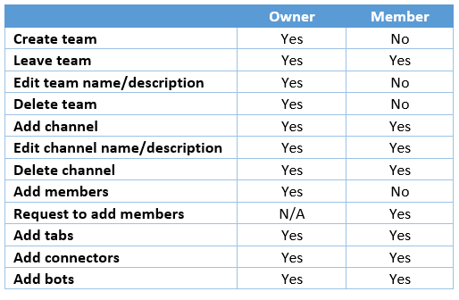

Teams has two types of roles:  users and administrators.

Users can be either owners or members of a team.

A team owner is the person who creates the team:

- Team owners can make any member of their team a co-owner when they invite them to the team or at any point after they've joined the team. Having multiple team owners lets you share the responsibilities of managing settings and membership, including invitations.
- Team members are the people who the owners invite to join their team.

The table shows the differences in permissions between an owner and a member. (Certain restrictions apply in some cases.)

If a team is created from an existing group, permissions are inherited from that group.

> [!NOTE]
> All users with Exchange Online mailboxes can create teams.

## Teams administrator roles

Teams administrator roles determine what capabilities each administrative role holder has. Four administrative roles are available in Teams:

- **Teams Service Administrator.** Manages the Teams service; creates and manages Microsoft 365 Groups.
- **Teams Communications Administrator.** Manages calling and meetings features within the Microsoft Teams service.
- **Teams Communications Specialist.** Troubleshoots communications issues within Teams by using basic tools.
- **Teams Communications Support Engineer.** Troubleshoots communications issues within Teams by using advanced tools.

## Moderators

Both team owners and members can have moderator capabilities for a channel (if moderation is turned on for a team). Moderators can start new posts in a channel and control whether team members can reply to existing channel messages. They can also control whether bots and connectors can submit channel messages.

Moderator capabilities are assigned at the channel level. Team owners have moderator capabilities by default. Team members have moderator capabilities turned off by default, but a team owner can give moderator capabilities for a channel to a team member. Moderators within a channel can add and remove other moderators within that channel.

## Assigning user and administrative roles

If a user in your Microsoft Teams organization needs permission to manage Azure Active Directory (Azure AD) resources, you need to assign the user an appropriate role in Azure AD, based on the actions the user needs permission to perform.  You assign Azure AD roles to a user, including administrative roles, by signing into the Azure portal using a Global Administrator account for the directory.

## Learn more

- [Assign team owners and members in Microsoft Teams](/MicrosoftTeams/assign-roles-permissions?azure-portal=true)
- [Manage access review for team members](/azure/active-directory/governance/access-reviews-overview?azure-portal=true)
