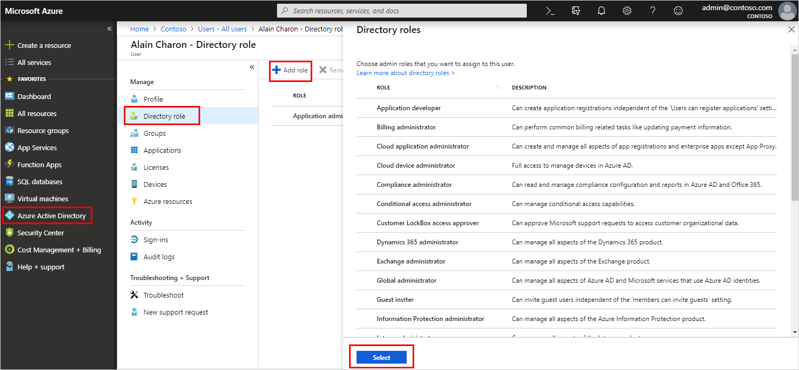

Organizations can designate two types of roles: users, who can be assigned varying permissions, and administrators, who need different levels of access. Administrators can also designate Teams users to be either owners or members of a team.  Users who create a new team become owners by default, and any owner can make other team members owners. If a team is created from an existing Office 365 Group, permissions are inherited from that group.

> [!NOTE]
> All users with Exchange Online mailboxes can create Teams.

You assign Azure AD roles to a user, including administrator roles, by signing into the Azure portal using a global administrator account for the directory. Here you can also assign roles using Privileged Identity Management (PIM).

The table below shows the difference in permissions between an owner and a member. (Certain restrictions apply in some cases.)

## Teams administrator roles

Teams administrator roles determine what capabilities each administrative role holder has. The four roles are:
 
- **Teams Service Administrator.** Manages the Teams service, and creates and manages Office 365 Groups.
- **Teams Communications Administrator.** Manages calling and meetings features within the Microsoft Teams service.
- **Teams Communications Specialist.** Troubleshoots communications issues within Teams by using basic tools.
- **Teams Communications Support Engineer.** Troubleshoots communications issues within Teams by using advanced tools.

## Assigning administrator roles

If a user in your Microsoft Teams organization needs permission to manage Azure AD resources, you need to assign the user an appropriate role in Azure AD, based on the actions the user needs permission to perform.

## Moderators

Both team owners and members can have moderator capabilities for a channel (if moderation is turned on for a team). Moderators can start new posts in a channel and control whether team members can reply to existing channel messages. They can also control whether bots and connectors can submit channel messages.

Moderator capabilities are assigned at the channel level.

- Team owners have moderator capabilities **turned on** by default. 
- Team members have moderator capabilities **turned off** by default, but a team owner can grant moderator capabilities to a team member.
- Moderators within a channel can add and remove other moderators within that channel.
