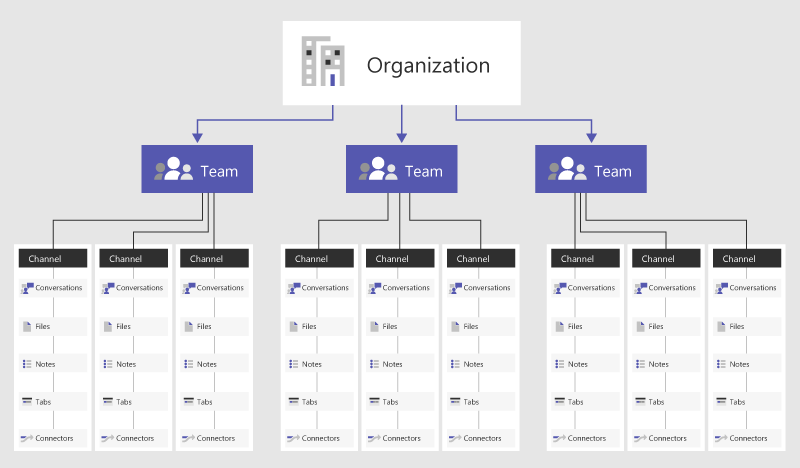
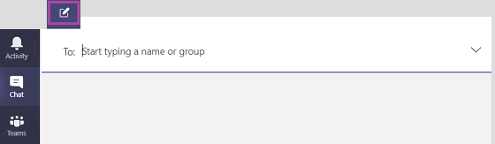

Microsoft Teams lets you quickly pull together a team with people inside and outside your organization, chat with others to drive fast and inclusive conversations, securely share and coauthor documents, and iterate on projects. Let's look at some of the key elements of the Teams user experience.
 
## What are teams?

A *team* is a collection of people, content, and tools surrounding different projects and outcomes within an organization. Teams can be created to be private to only invited users. Teams can also be created to be public and open and anyone within the organization can join (up to 5,000 members). You can then designate one or more of these members to be team owners with administrative privileges.

Teams can be dynamic for project-based work (for example, launching a product), as well as ongoing, to reflect the internal structure of your organization (for example, departments and office locations). Conversations, files, and notes across team channels are only visible to members of the team.

## What are channels?

*Channels* are dedicated sections within a team that keep conversations organized by specific topics, projects, or disciplines. Files that you share in a channel (on the **Files** tab) are stored in SharePoint.

Team channels are places where everyone on the team can openly have conversations. Channels are most valuable when extended with apps that include tabs, connectors, and bots that increase their value to the members of the team, as described in the module **Manage apps, bots, and connectors.**

## What is chat?

While channel conversations are public, *chats* are just between you and someone else (or a group of people). Think of them like instant messages in other messaging apps. Private chats are only visible to the chat participants.

You start one-on-one and group chats the same way: by selecting **New chat** at the top of Teams. Once in a chat, you'll be able to send messages that include files, links, emojis, stickers, and GIFs. There are many formatting options for chat messages, including options for highlighting, font size, lists, and more.

Teams saves your whole chat history, all the way back to the first message you sent—this is known as *persistent* chat. If someone leaves your organization, that person's chat responses will remain in your chat history.

## Learn more

When you're done with a link, use the **Back** arrow in your browser to come back to this page.

- [Welcome to Microsoft Teams](/microsoftteams/teams-overview)
