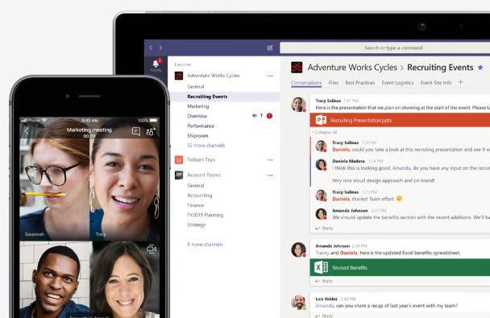

Microsoft Teams is your hub for teamwork in Microsoft 365. Teams is a chat-based workspace that brings together chat, meetings, calling, and Microsoft 365, all-in-one. And it's built on the trust of Microsoft security and compliance that's crucial for today's businesses.

Teams delivers in four core areas to create a digital workspace for high-performing teams: Communicate, Collaborate, Customize, and Work with confidence.

## Communicate

Teams meets the communication needs of a diverse workforce by providing a complete meeting and calling solution, including chat, voice, and video. You can use Teams for informal 1:1 or group chats by using the Teams desktop or web client or directly on your phone if you're on the go. You can also have an open conversation in a channel so people can share information in a transparent way to accelerate decision-making. It's easy to move from a chat into a face-to-face meeting, helping you to bridge geographical barriers.

## Collaborate

When it comes to collaboration, the deep integration of Teams with Microsoft 365 enables today's multigenerational workforce to use the Office apps they are familiar with—Word, Excel, PowerPoint, OneNote, SharePoint, Planner, even Power BI—right within the context of Teams. Teams brings all the services together so that you can easily share and co-author files.

## Customize

With Teams, you no longer need to jump between Microsoft 365 apps and services. Because Teams is the hub for all the services and tools your teams use on a day-to-day basis, you can customize Teams with tabs, connectors, and bots to include the apps and services you need, including common third-party apps. Teams is an extensible platform that enables you to build apps and integrate with business processes. 

## Work with confidence

Microsoft Teams comes with the enterprise-grade security, compliance, and manageability that you expect from Microsoft 365.  
