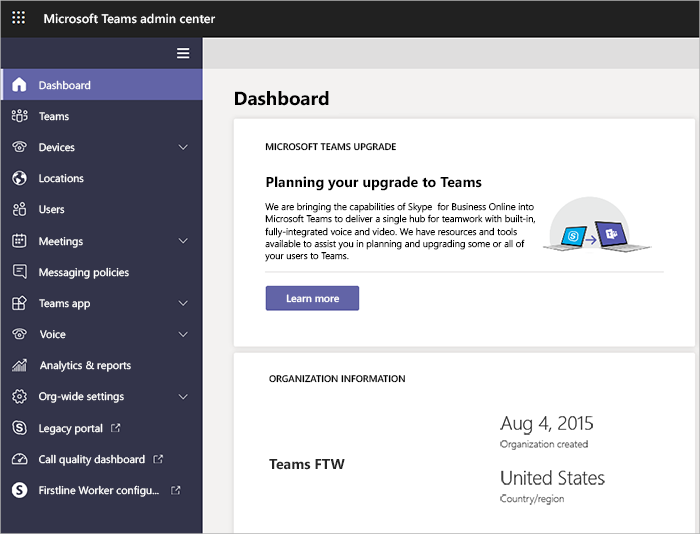

Microsoft Teams gives admins powerful tools to manage teams and connect users. Two general types of management tools are employed: graphical user interfaces (GUIs) and command-line and automation tools. Be aware that to take advantage of full administration capabilities using these two toolsets, you need to be assigned either the Global or Teams Service Administrator role.

The primary GUI tools for Teams management are:

- Microsoft Teams admin center
- Azure Active Directory admin center
- Microsoft 365 admin center
- Office 365 security and compliance center

Command-line and automation tools include:

- PowerShell, for configuration and limited lifecycle management
- Graph API, for lifecycle management

## Use Microsoft Teams admin center

Teams management tools can be accessed in the Microsoft Teams admin center under **Teams > Manage teams**. Each team is backed by an Office 365 group, and this node provides a view of groups that have been enabled for Microsoft Teams in your organization. Admins can edit group and team-specific settings here. 

## Use Microsoft 365 admin center

You can turn apps off or on for Teams in tenant-wide settings in the Microsoft 365 admin center. You must have Office 365 admin permissions to access these settings. Under Apps, you can enable and disable default apps and configure settings to control external apps.
 
Default apps, such as Planner, Praise, and Weather, are provided by Teams. To turn on an app, select the check box for that app. To turn off an app, clear the check box. 
External apps are provided by third parties. You can configure the following settings for external apps:

- Allow external apps in Microsoft Teams
- Allow sideloading of external apps
- Enable new external apps by default

You can also control organization-wide user settings in the Microsoft Teams admin center under **Org-wide settings**.

## Use PowerShell

PowerShell is a shell and scripting language that helps system administrators and power users rapidly automate management tasks from a command line.  Admins can use PowerShell to manage settings, configuration, and policy in Teams. However, with PowerShell you have a limited ability to manage actual teams.

The PowerShell controls for managing Teams are found in two different PowerShell modules: the **Microsoft Teams PowerShell module**, and the **Skype for Business PowerShell module**. The Teams PowerShell module contains all the cmdlets you need to create and manage teams. The Skype for Business PowerShell module contains the cmdlets to manage policies, configurations, and other Teams tools.

These cmdlets work only on the teams for which you are an owner or a member. Global Admins or Teams Service Administrators can act on all teams in your organization.

> [!NOTE]
> For general Windows PowerShell, Microsoft Teams PowerShell, and Skype for Business PowerShell information, check out the [Windows 10 PowerShell command reference](/powershell/windows/get-started).

