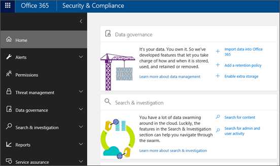
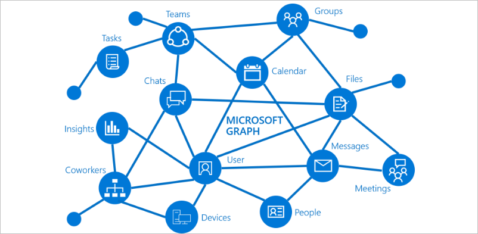

Microsoft Teams gives administrators powerful tools to manage teams and connect users. Two general types of management tools are employed: graphical user interfaces (GUIs) and command-line and automation tools. To take advantage of full administrative capabilities using these two toolsets, you need to be assigned either the global or Teams service administrator role.

The primary GUI tools for Teams management are:

- Microsoft Teams admin center
- Azure Active Directory admin center
- Microsoft 365 admin center
- Office 365 Security & Compliance Center

Command-line and automation tools include:

- PowerShell, for configuration and limited lifecycle management
- Graph API, for lifecycle management

## Use Microsoft Teams admin center

Teams management tools can be accessed in the Microsoft Teams admin center under **Teams > Manage teams**. Each team is backed by an Office 365 Group, and this node provides a view of groups that have been enabled for Microsoft Teams in your organization. Administrators can edit group and team-specific settings here. 

## Use Microsoft 365 admin center

<<<<<<< HEAD
You can turn apps off or on for Teams in tenant-wide settings in the Microsoft 365 admin center. You must have Office 365 administrative permissions to access these settings. Under **Apps**, you can turn default apps on and off and configure settings to control external apps.
 
Default apps, such as Planner, Praise, and Weather, are provided by Teams. External apps are provided by third parties. You can configure the following settings for external apps:
=======
You can turn apps off or on for Teams in tenant-wide settings in the Microsoft 365 admin center. You must have Office 365 admin permissions to access these settings. Under Apps, you can enable and disable default apps and configure settings to control external apps.
 
Default apps, such as Planner, Praise, and Weather, are provided by Teams. To turn on an app, select the check box for that app. To turn off an app, clear the check box. 
External apps are provided by third parties. You can configure the following settings for external apps:
>>>>>>> 4d22aee82b983af70813e8fcdce3e4400772f86a

- Allow external apps in Microsoft Teams
- Allow sideloading of external apps
- Enable new external apps by default

You can also control organization-wide user settings in the Microsoft Teams admin center under **Org-wide settings**.

## Use Office 365 Security & Compliance Center

The Office 365 Security & Compliance Center is designed to help you manage compliance features across Office 365 for your organization, including Teams. Links to existing SharePoint and Exchange compliance features bring together compliance capabilities across Office 365. To use the Security & Compliance Center, you must either be assigned the Office 365 global administrator role or have been assigned to one or more Security & Compliance Center role groups by a global administrator.

## Use PowerShell

PowerShell is a shell and scripting language that helps system administrators and power users rapidly automate management tasks from a command line.  Administrators can use PowerShell to manage settings, configuration, and policy in Teams. However, with PowerShell you have a limited ability to manage actual teams.

The PowerShell controls for managing Teams are found in two different PowerShell modules: the **Microsoft Teams PowerShell module**, and the **Skype for Business PowerShell module**. The Teams PowerShell module contains all the cmdlets you need to create and manage teams. The Skype for Business PowerShell module contains the cmdlets to manage policies, configurations, and other Teams tools.

These cmdlets work only on the teams for which you are an owner or a member. Global administrators or Teams service administrators can act on all teams in your organization.

> [!NOTE]
> For general Windows PowerShell, Microsoft Teams PowerShell, and Skype for Business PowerShell information, check out the [Windows 10 PowerShell command reference](/powershell/windows/get-started).

## Use Microsoft Graph API

Microsoft Graph is the gateway to data and intelligence in Microsoft 365. Graph provides a unified programmability model that you can use to access the tremendous amount of data in Office 365, Windows 10, and Enterprise Mobility + Security. Graph is built on a REST-based API that allows access to Teams and other Microsoft 365 services.

In Graph, Teams is represented by a group resource, since Teams and Office 365 Groups both work together to facilitate group collaboration. Most of the same group-based features apply to Microsoft Teams and Office 365 Groups, the main difference being the way members communicate with each other. Team members communicate by persistent chat in the context of a specific team. Office 365 Group members communicate by group conversations, which are email conversations that occur in the context of a group in Outlook. Microsoft Graph is a very powerful tool for managing actual teams.
