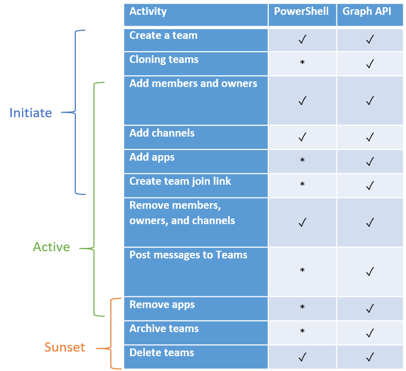

Planning for lifecycle management is essential if your organization is to get the most benefit out of Microsoft Teams. Like most projects, creation and management of teams passes through beginning, middle, and end stages. However, Teams has such a variety of uses that it may not always be obvious which stage a project is in. Having a plan for lifecycle management will help you track your organization's projects as they go through these stages.

## Teams lifecycle

In Teams, each individual team has its own lifecycle with the following sequence:  

1. Initiate
1. Active
1. Sunset

Broadly speaking, the lifecycle of a Teams team encompasses both configuration—*static* settings and policies—and management, which is dynamic per team during the lifecycle.

> [!div class="centered"]
> :::image type="content" source="../media/lifecycle.png" alt-text="Teams lifecycle sequence" lightbox="../media/lifecycle.png":::

The Teams lifecycle is configured by the team owner. Lifecycle configuration differs from Teams configuration because the latter is concerned with global settings and user-specific configurations that rarely change once they've been defined.

Proactive administrator activities include initiating creation of teams (including owners, members, channels, and so on), and sunsetting of teams as required by the business. Reactive administrator activities include changing team settings on behalf of the owner and adding team owners for orphaned teams.

## Teams lifecycle stages

Typically, the stages of each team's lifecycle include a beginning, middle, and end, when the team has completed its purpose and reached the end of its useful life.

The **beginning stage** involves defining the team's goal and membership; creating the team and its channels; inviting team members; and setting permissions for individual members. Key decision points to consider in the beginning stage include:

- What is the team's purpose?
- Who belongs on the team?
- Will the team be private or public?
- Can new members add themselves or do team owners add them?
- Who will have permissions to create channels or add tabs, bots, and connectors?
- What initial channels will be added to the team?

In the **middle stage**, collaboration takes place according to an established workflow, with team members interacting toward common goals within team channels. Decision points you should consider in this stage include:

- Who will monitor usage to identify problems?
- What metrics will be used to determine team health?
- Identifying any teams that have reached the end of their useful life.
- Identifying unhealthy teams that still serve a purpose but need revitalizing.

The **end stage** occurs when a team has concluded its useful lifecycle, normally for a finite project. In this stage, you formally acknowledge the closing of the team and delete teams you no longer need; note that this is a *soft delete* that IT can reverse for up to 21 days (30 days for Microsoft 365 Groups). Deleting teams doesn't affect any chats or content that were retained in accordance with compliance policies. Important decision points related to the end stage include:  

- Defining what the end of a team's life looks like.
- Deciding whether to keep a team's stored content available, and for how long.
- Documenting best practices and lessons learned.
- Archiving data, if necessary.

## Automation throughout the lifecycle

This diagram visualizes a team lifecycle using PowerShell and Graph API automation tools.

## Learn more

When you're done with a link, use the **Back** arrow in your browser to come back to this page.

- [Plan for lifecycle management in Teams](/microsoftteams/plan-teams-lifecycle)
