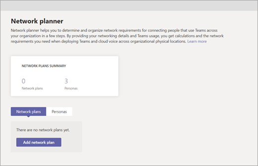

To prepare to deploy Teams, you should review your network requirements. Make sure that you have the required bandwidth, access to all required IP addresses, the correct ports opened, and that you're meeting the performance requirements for real-time media.

Teams combines three types of network traffic:

- Data traffic between the Microsoft 365 online environment and the Teams client (signaling, presence, chat, file upload and download, OneNote synchronization)
- Peer-to-peer real-time communications traffic (audio, video, desktop sharing)
- Conferencing real-time communications traffic (audio, video, desktop sharing)

This impacts the network on two levels: Traffic flows between the Teams clients directly in peer-to-peer situations, and between the Microsoft 365 environment and the Teams clients for meetings. To make sure that traffic flow is optimal, you should allow data to flow between the internal network segments (such as between sites over the wide area network (WAN)) and between the network sites and Microsoft 365. Not opening the correct ports or actively blocking specific ports will lead to a degraded experience.

To get an optimal experience with real-time media within Teams, your network must meet the networking requirements for Microsoft 365.

## Consider your network capabilities

When planning a Teams deployment, consider these network-related questions before getting started:

- Connectivity to the Microsoft 365 network
  - Are all required IPs and ports reachable?
  - How is traffic routed to the Microsoft 365 network?
- Quality of the network: What are the latency, jitter, and packet-loss rates of the network?
- Available bandwidth: Is there sufficient bandwidth for your users and the underlying technologies?

Other factors that can potentially influence media quality in Teams are acoustical and visual noise in the environment, and which devices you use for capturing and playing back audio and video. Also keep in mind that most wireless networks are not designed for real-time communication—a wired network is preferred whenever possible.

## Use the Network Planner

In just a few steps, the Network Planner can help you determine and organize network requirements for connecting Teams users across your organization. When you provide your network details and Teams usage, the Network Planner calculates your network requirements for deploying Teams and cloud voice across your organization's physical locations.

Network Planner allows you to:

- Create representations of your organization using sites and Microsoft-recommended personas (office workers, remote workers, and Teams room system).
- Generate reports and calculate bandwidth requirements for Teams usage.

To use Network Planner, you must be a Global Administrator, Teams Service Administrator, or Teams Communications Administrator.

## Use Microsoft Skype for Business Network Assessment Tool

After you've completed your planning and network preparation—including upgrading bandwidth and opening ports in the firewall, you should test your network's performance. The results of this testing will give you a clearer picture of any network optimization or remediation required for the success of your Teams implementation.

You can download the Skype for Business Network Assessment Tool via the **Learn more** link below. Use the tool to test whether your network is ready for Teams. The tool offers dual functionality: it can test whether all the correct ports have been opened, and it can test for network impairments.

After you download and install the tool, you can find it in C:\Program Files (x86)\Microsoft Skype for Business Network Assessment Tool. A detailed guide for how to use the tool, Usage.docx, is included in that directory.

## Utilize your bandwidth

Microsoft Teams gives you the best audio, video, and content-sharing experience regardless of your network conditions. Teams is always conservative on bandwidth utilization and can deliver high-definition video quality in under 1.2 Mbps. The actual bandwidth consumption in each audio/video call or meeting will vary based on several factors, such as video layout, video resolution, and video frames per second. The call quality increases whenever more bandwidth is available.

With variable codecs, media can be negotiated in limited-bandwidth environments with minimal impact. But where bandwidth is not a concern, your users' experiences can be optimized for quality, including up to 1080p video resolution, up to 30 fps for video and 15 fps for content, and high-fidelity audio.

## Learn more

When you're done with a link, use the **Back** arrow in your browser to come back to this page.

- [Prepare your network for upgrading to Teams](/microsoftteams/upgrade-prepare-environment-prepare-network).
