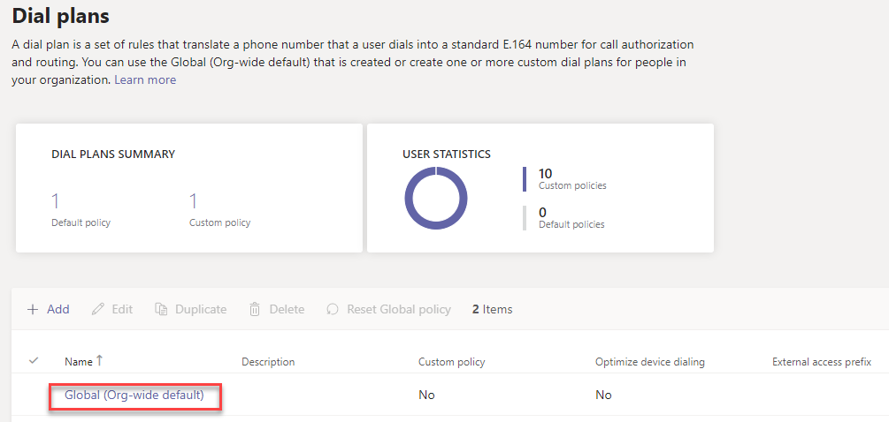
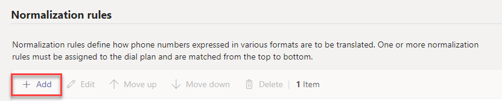
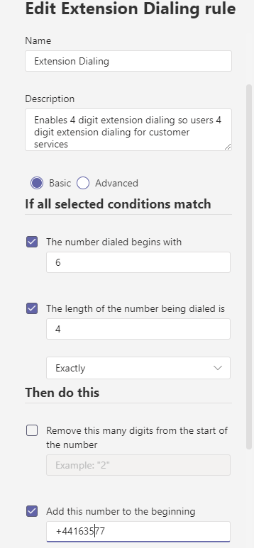

When you have designed and started setting up and using your auto attendants, you can start experimenting with more advanced features to help refine and automate the phone system process.

In your digital camera manufacturer, you want customers to be able to reach a specific support worker, if they have their direct dial number. You also want to set up mailboxes that whole support teams can access and retrieve message from.
Here, you'll learn how to set up extension dialing and shared mailboxes in Microsoft Teams.

## Extension dialing

Sometimes, it's useful to have small easy to remember extension numbers for employees. Users can dial a 3 or 4-digit extension number to reach specific people or a call queue. It's likely they want to do that because that's what they were used to in a previous system. We want to minimize friction when migrating to a new system to ensure there is adoption.

The following steps show how to implement extension dialing:

1. Open the Teams Admin Center, expand **Voice**, and go to **Dial Plans**.
1. Select the **Global Dial Plan** or your custom dial plan or create a new one to assign to users.

    

1. Under **Normalization rules**, select **Add**.

    

1. Fill in the form with the correct details.

    

## Shared mailboxes

Microsoft Teams auto attendants now support redirection to voicemail. With this feature, you can redirect callers to shared Microsoft 365 group voicemail boxes. As the screenshot below shows, you can set up the flow so that the caller leaves a voicemail with the group shared voicemail box.

:::image type="content" source="../media/4-shared-voicemail.png" alt-text="Shared Voicemail":::

## Learn more
  
- [Call flow - extension dialing](/microsoftteams/create-a-phone-system-auto-attendant#call-flow)
- [Extension dialing (non MS)](https://ucstatus.com/2020/03/30/use-extension-dialing-in-microsoft-teams/)
- [Shared mailbox - VIDEO](https://www.youtube.com/watch?v=Iepnko_v0ro&list=PLaSOUojkSiGnKuE30ckcjnDVkMNqDv0Vl)
