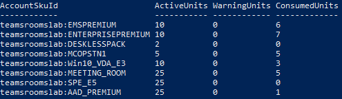

You can also use PowerShell to configure resource accounts. PowerShell is the fastest way to create accounts in bulk. If you need to create multiple accounts, you can create a PowerShell script to automate the account creation. There are also some features and settings that are only available via PowerShell.

There are two mandatory PowerShell modules needed to create a resource account. One is **MSOnline**, which is the Azure Active Directory PowerShell module. The other is the **Exchange Online** PowerShell module.

1. To connect to Microsoft 365, run the **Connect-MsolService** and **Connect-ExchangeOnline** cmdlets, passing in your credentials when prompted.
2. Make sure you have enough licenses by running the **Get-MsolAccountSku** cmdlet. This will return all your licenses. 

   

   In this example, you can see that there are 25 Meeting Room licenses and five of them have been consumed (or assigned). This means there are 20 licenses available to assign to resource accounts.

   When creating accounts via PowerShell, it is advantageous to use variables to store values. Throughout these following cmdlets, you will re-use the same values several times. Storing these values in a variable will make these commands easier to run successfully. It also sets the stage for writing your own script if you need to create many resource accounts at once. 

3. Create a few variables (in this case) like account UPN, mailbox name, mailbox alias, and password. 


   **Account name**

   `$acctUpn=mtrfocusroom1@teamsdevicesdemo.onmicrosoft.com`

   **The unique name of the mailbox**
   
   `$MailBoxName 'focusroom'`

    **Specify the Exchange alias** (also known as the mail nickname) for the recipient
	
   `$MailBoxAlias='focusroom'`

    **Define the password for the account**
	
   `$Password='ThisIs1ReallyLongPassword!'`

    **Set the license to assign**
	
   `$ADLicense='teamsdevicesdemo:MEETING_ROOM'`

    **Two letter ISO code** for the country where the tenant is registered
	
   `$UsageLocation='US'`


   - Note that the password is in clear text. If you set the password using this method, be sure to immediately go into the Microsoft 365 Admin Center and change the password to something else.

4. As mentioned earlier, the resource account is really an Exchange mailbox. Here's the command to create the mailbox as a resource account.

   ```powershell
   New-Mailbox -MicrosoftOnlineServicesID $acctUpn -Name $DisplayName -Alias $MailBoxAlias -Room -EnableRoomMailboxAccount $true -RoomMailboxPassword (ConvertTo-SecureString -String $Password -AsPlainText -Force)
   ```

5. The next thing you need to do is enable calendar processing. You do this using the **Set-CalendarProcessing** cmdlet.


   ```powershell
   Set-CalendarProcessing -Identity $MailBoxAlias -AutomateProcessing AutoAccept -AddOrganizerToSubject $false -DeleteComments $false -DeleteSubject $false ‐RemovePrivateProperty $false
   ```

   - After identifying the account that was created in the previous command, the *AutomateProcessing* parameter was set to **AutoAccept**. This tells the resource account to automatically process meeting invites instead of waiting for human intervention.  
   - *AddOrganizerToSubject* is set to **False**.  That means when the meeting is shown on the center of table console, it will only show the meeting name and not the meeting name and the organizer name. For example, it will display "Weekly Status Meeting" instead of "Megan Bowen Weekly Status Meeting."
   - The *DeleteComments* parameter is set to **False**. This means the body of the e-mail will not be deleted. This parameter is required to be false when using 3rd party guest join (e.g., being able to join Cisco or Zoom meetings via Teams Rooms).
   - You can choose to delete the Subject of the meeting invite using the *DeleteSubject* parameter and then the meetings on Teams Rooms will be called by the name of the meeting organizer, such as "Megan Bowen." This is a security feature to prevent someone from walking through a restricted area and seeing meeting subjects that might leak information, such as "Meeting About Acquisition of Company X." If you enable deleting the subject, the meeting title would be "Megan Bowen's Meeting" and you would have no idea what the meeting is about.

6. If the meeting is flagged as private, keep that flag set as private by setting *RemovePrivateProperty* to **False**.
7. Set the resource account password to never expire and then assign the license.


   ```powershell
   Set-MsolUser -UserPrincipalName $acctUpn -PasswordNeverExpires $true ‐UsageLocation $UsageLocation

   Set-MsolUserLicense -UserPrincipalName $acctupn -AddLicenses $ADLicense
   ```

## Convert a Skype for Business user account

In Skype for Business, you have two options.
 
- Use a Skype for Business user account and configure the Exchange settings to **auto accept**.
- Convert a user account to a meeting room account. 

There are a few unique considerations when converting a user account to a meeting room account. 

- The resource account will now always join via the lobby. When joining a meeting, the room is entered through the lobby and the organizer will have to manually add the room into the meeting from the lobby.
- Another change when converting a user to a meeting room is that Skype for Business now knows a meeting room has been invited. Attendees will be asked if they want to mute their devices before joining the meeting in order to limit echo and feedback.
- One other thing to be aware of is when you convert a user to a meeting room, is that meeting room will no longer appear when you run the **Get-CsUser Skype for Business** PowerShell cmdlet. Instead, you'll have to run **Get-CsMeetingRoom** to list your meeting rooms.

Create an Exchange Resource Mailbox as described above and then run **Enable-CsUser**. 

```powershell
Enable-CsUser -Identity MTR-STP-Avanti-1@contoso.com -RegistrarPool "skypepool.contoso.com" -SipAddressType SamAccountName -SipDomain contoso.com
```

You could also do this using the Skype for Business control panel.

Here's the command to convert this account to a meeting room. Note that the Identity parameter is the same as in the previous command.


```powershell
Enable-CsMeetingRoom -Identity MTR-STP-Avanti-1@contoso.com -RegistrarPool "skypepool.contoso.com" -SipAddressType SamAccountName -SipDomain contoso.com
```

## Learn more

- [PowerShell module browser](https://docs.microsoft.com/powershell/module/?azure-portal=true)
- [Deploy Microsoft Teams Rooms with Microsoft 365](https://docs.microsoft.com/MicrosoftTeams/rooms/with-office-365?azure-portal=true)
