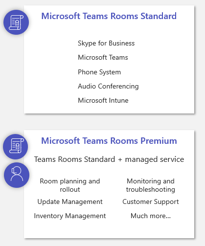
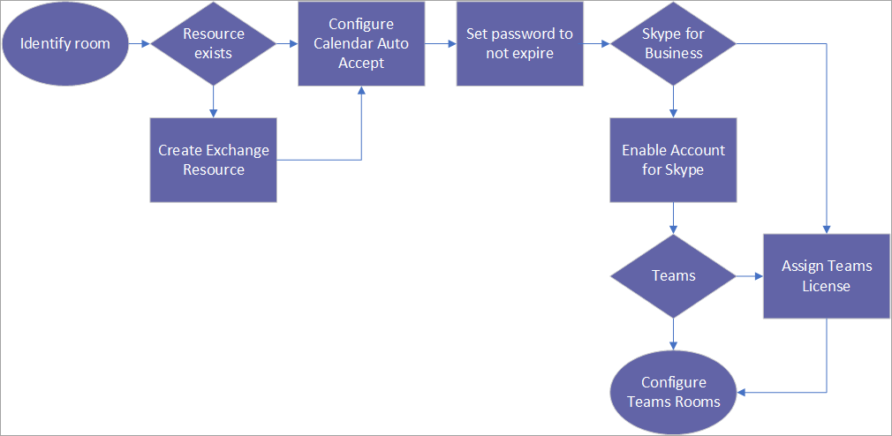

The resource account is a Microsoft Exchange mailbox. Specifically, it's a Microsoft Exchange resource mailbox.
 
When people schedule a room, it is this resource mailbox that they invite to their meeting. This mailbox will - on behalf of the room - accept or decline the meeting invite. This resource account is also the account that signs into the Microsoft Teams Rooms app. It must be enabled for Skype for Business and/or Microsoft Teams.

Try to establish a naming convention, particularly when you move to Azure Active Directory (Azure AD) and the concept of dynamic groups. A resource account can automatically be added to Azure AD groups based on the naming convention. It is recommended that you assign the Teams Rooms Standard or Teams Rooms Premium license to all Teams Rooms resource accounts. The Teams Rooms Standard license is a cost-effective license that includes all the core components needed for Teams Rooms.

The Teams Rooms Premium license adds additional features such as a Microsoft-managed service that will help with everything from planning your rooms to monitoring and troubleshooting them. This license also includes everything in the Standard license.

> [!IMPORTANT]
> Every Teams Rooms device requires its own unique resource account. You cannot share a resource account across multiple rooms. If you do, only one of those accounts will be able to join a meeting and other rooms with the same account will not be able to join any meetings at the same time.

- If you use Skype for Business on-premises, you'll need to assign an Enterprise Client Access license, and if you intend to use Enterprise Voice features of Skype for Business, you'll need a Plus Client Access license.
- Dial-in to a Microsoft Teams meeting and "call me at" features are included in the audio conferencing license. (Dial-in to Microsoft Teams meetings is defined as someone remote or driving being able to dial the phone number with a mobile phone to join the meeting.) 
- if you'd like to make and receive any phone call outside of an audio conference via Microsoft Teams, you will either need to assign a calling plan license or configure direct routing. If you're configuring direct routing, no additional licenses are needed as the phone system license is already included with a Teams Rooms Standard or Premium license.
- It's recommended that you create the account well in advance of hardware installation. This is because you may need to open tickets within your IT organization to have them created. You also need to test and review to make sure the accounts were set up correctly.

If your environment is configured to use modern authentication, it is recommended you enable it for the resource account. You can use Intune conditional access policies to help control and limit what the resource account has access to. For example, you can limit the account to only sign in on a given subnet.  All credentials are secured on the device through a physical TPM chip and are stored in the Windows Vault. *Physical TPM chips are required on all compute modules used by Teams Rooms*.

## What is the workflow for creating a resource account?

1. First identify what room you are going to use with Teams Rooms. Does a resource already exist? It's very possible that a resource account for this room was created previously for other purposes.

   - If that is the case, you can then move forward with configuring auto accept. 
   - If there is not an existing resource, create a new Exchange resource and then configure auto accept within Exchange.

2. Once the auto accept parameters for the Exchange mailbox have been configured, you will need to set the password to never expire. *Resource accounts must have their password set to not expire*. Otherwise, the account will not be able to sign in to Teams Rooms when it’s password has expired and no one will be able to join meetings in that room until someone physically changes the password on the Teams Rooms application. 

3. Will you enable this account for Skype for Business?

   - If yes, enable the account for Skype. 
   - If not, assign a Teams license. 

4. If you have enabled the account for Skype, will you enable it for Teams as well as for Skype? If yes, assign a Teams license. 

    

You can now move on to configure the Teams Rooms application.

## Learn more

- [Configure accounts for Microsoft Teams Rooms](https://docs.microsoft.com/MicrosoftTeams/rooms/rooms-configure-accounts?azure-portal=true)
- [Teams Room licensing update](https://docs.microsoft.com/MicrosoftTeams/rooms/rooms-licensing?azure-portal=true)
