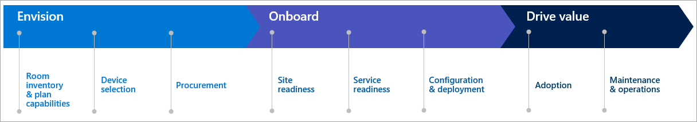

The goal of a standard deployment is to make sure that you have a simple and repeatable rollout across many locations – be that within a city, a country, or globally.

You'll want to try to standardize on procurement and have as many of the same components in as many rooms as possible. Will you ship all the devices to a central location, configure them there, and then ship them out to the remote locations for installation? Or will you drop ship everything directly to the final location, and then do all the configuration on site?

The more consistent you can be with these practices, the more efficient you'll be in supporting, implementing, and operating Teams Rooms in the future.

Here's a high-level project plan highlighting all the key milestones in a Teams Rooms deployment.

To assist in the deployment, you'll need several teams:

- The facilities team is there to help with room inventory, hanging, drilling, powering displays, and putting up signage.
- The AV team is used to plan, configure, install, and support Teams Rooms.
- The IT project team will help with network readiness, provisioning and configuration of resource accounts, as well as assisting with monitoring, maintaining, and operating the Teams Rooms environment.
- You may also have system integrators that assist with some or all these roles.

## Plan your deployment

**Set standards based on room sizes**. When possible, you'll want to set standards based on the size of a room. For small rooms, you'll use certain devices while you'll use different devices sized for large rooms. Microsoft provides meeting room archetype specifications for different-sized meeting rooms. You can find these by browsing to the [Microsoft Teams devices page](https://www.microsoft.com/microsoft-365/microsoft-teams/across-devices/devices/category?devicetype=20?azure-portal=true). From here, you can scroll down on the left navigation, expand **Space**, and select the room size you need to configure.

**Plan for product delays**. Unexpected things can happen, like a pandemic, which puts a slowdown on shipping and delivery schedules.

**Standardize room installation**. Make sure you have standards for how you're going to run and organize the cables and where you're going to mount devices. If you're going to mount compute devices behind displays, make that a standard too.

**Understand your device setup and configuration**. Be sure you have a good understanding of the device setup instructions and any necessary configuration files.

**Create a cabling diagram**. Where possible, create a clear, detailed cabling diagram that you can send to your remote staff. This will greatly expedite their ability to support and troubleshoot Teams Rooms.

**Don't forget training**. It doesn't matter how great the Teams Rooms implementation is and how wonderful you did your job. If end-users are not familiar with how to use the system, they probably won't use it, and you won't receive a lot of reward for all your effort.
