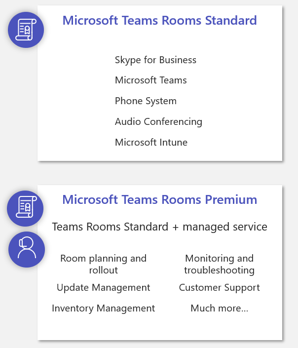

Teams rooms has several requirements to assure a great meeting room experience. Below is a summary of things you need to keep in mind before deploying Teams Rooms.

## What are the hardware requirements?

Teams Rooms is only available as a Microsoft  certified system. You can't build your own Teams Rooms. This is done to be certain that Teams Rooms will provide an excellent experience for in-room and remote attendees.

You can have up to two 1080p displays with HDMI connections connected to Teams Rooms. Teams Rooms does support 4K monitors but will only send a 1080p image.

It's recommended that you use a USB keyboard and mouse for initial configuration of Teams Rooms. Once the room is in production, you can safely remove the keyboard and mouse. Attendees in Teams Rooms meetings never need to use a USB keyboard and mouse as all interaction is handled by the center of table console.

A wired network connection is also required. Microsoft doesn't support wireless networking with Teams Rooms. Proxy bypass is strongly encouraged.

## What are the software requirements?

On the software side, you will need to have a Microsoft Teams license and/or Skype for Business license. If you're using on-premises Skype for Business, be sure to install the enterprise trusted root certificate onto the compute module.

You will also need Exchange Online or Exchange on-premises. An Exchange license is not required if the Teams Rooms account is configured as an Exchange resource account.

## What are the configuration requirements?

For initial configuration, Teams Rooms requires DHCP. However, once you have configured the device, you can switch from DHCP to a static IP address. 
When using Teams or Skype for Business, be sure that all the proper ports and protocols are enabled for access via your firewalls or proxy servers.

## What about licensing?

You should use either the Microsoft Teams Rooms Standard or Microsoft Teams Rooms Premium license. These are Microsoft 365 licenses that contain all the required licensing components for Microsoft Teams Rooms.  Every Teams Rooms has a unique resource account, and it is this resource account that will need the license. Using a meeting room license assures that you have everything correctly configured on the licensing side.

The Teams Rooms Premium license adds a managed service component to the Teams Rooms Standard license. This managed service is run by Microsoft and will help you manage, monitor, and maintain Teams Rooms across your organization. It will help you have an optimal experience with Teams Rooms.

## What deployment roles are needed?

Finally, when rolling out Teams Rooms, there are several roles that will be needed within the deployment.

- A System Integrator can help to design conference rooms and meeting rooms and help with the assessment, validation, and equipment ordering. They can make sure the project moves along in a timely manner and they can help install the devices. They can also  help provide training and support for both end users and administrators.
- You're going to need somebody who is familiar with audio and video. You'll  need Microsoft Teams or Skype for Business experts who understand how your environment is configured.
- If you will be enabling dial-in calling, you will need to add the telecommunications department to help assign telephone numbers.
- You'll need someone familiar with the network to make sure switch ports are set up correctly and firewalls and proxies are properly configured. You'll need someone with rights to create an Exchange mailbox, change passwords, and perform end-user management.
- Finally, you'll need to make sure you work with your facilities group so that everything you're adding to the building is compliant and meets local laws.

## Learn more

- [Microsoft 365 and Office 365 URLs and IP address ranges](/microsoftteams/office-365-urls-ip-address-ranges?azure-portal=true)
- [Microsoft Teams devices](https://www.microsoft.com/microsoft-365/microsoft-teams/across-devices/devices/category?devicetype=20?azure-portal=true)
- [Microsoft Teams licensing](/microsoftteams/rooms/rooms-licensing?azure-portal=true)
- [Teams Rooms Premium](https://rooms.microsoft.com?azure-portal=true)
