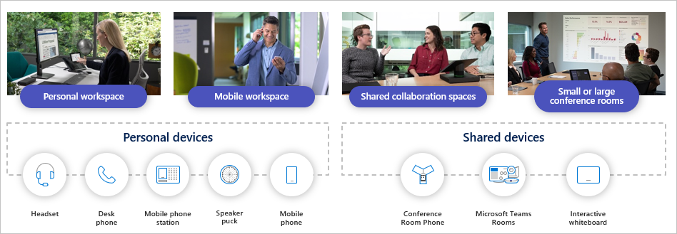
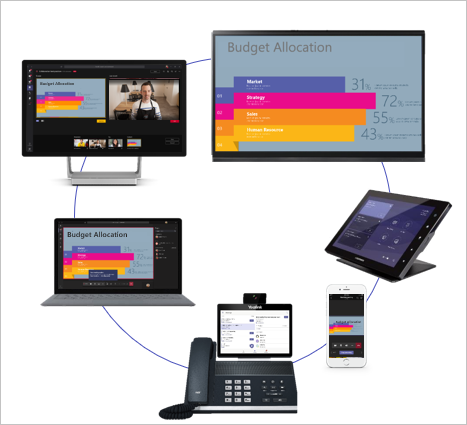

Microsoft Teams devices work in many spaces, such as at home, on the go, or in the office.

Shared devices include devices such as collaboration bars for Microsoft Teams, Surface Hub,  and Teams Rooms.

Microsoft Teams has a consistent look and feel, whether you're using a workstation, a mobile device, or Teams Rooms. All the devices have similar features such as collaborating with screen sharing, live camera, and audio.

Mobile devices are excellent for joining Microsoft Teams meetings when you're on-the-go. They support the full Teams meeting experience with audio, video, and sharing. For example, you can take a photo on a mobile device, preview the photo, and then present it directly into a meeting.

With Microsoft Teams devices, you can work with confidence, knowing that certified devices provide high-quality audio and video, enterprise security, easy setup, and a consistent look and feel. All Teams devices are purpose-built to Microsoft standards, addressing and optimizing different workspaces and work styles. Microsoft Teams devices carry a certification called *Certified for Microsoft Teams*. This certification ensures that devices meet specific quality and performance goals that will give you an excellent meeting experience. If you have older devices that are certified for Skype for Business, that certification carries forward. Your existing investment in Skype for Business devices is protected.

Teams Rooms has all the audio, video, and sharing features required to run a great meeting. One-touch join is key: walk up to the console, press one button, and you are joined into the meeting. This makes it easy for users who are unfamiliar with Teams Rooms to join a meeting. With the right Teams license, you can even make and receive phone calls thus making it a conference phone alternative.

Any space can be a Microsoft Teams meeting place, from small focus rooms all the way up to conference rooms and auditoriums. The high definition audio and video provided by Teams-certified devices assures that you will have a quality meeting experience in a Teams Room.

You can use the same management tools you already use with Teams Rooms.  This leads to a low training effort to deploy and manage Teams Rooms across your corporation. Microsoft Teams Rooms runs as a Universal app on Windows 10. In the center of the room is a touch controller we call the console that displays the Microsoft Teams Rooms app. The center of room console can connect with multiple displays, projectors, cameras, speakers, and compute modules.

## Learn more

- [Certified Teams Room devices](https://www.microsoft.com/microsoft-365/microsoft-teams/across-devices/devices/category?devicetype=20?azure-portal=true)
