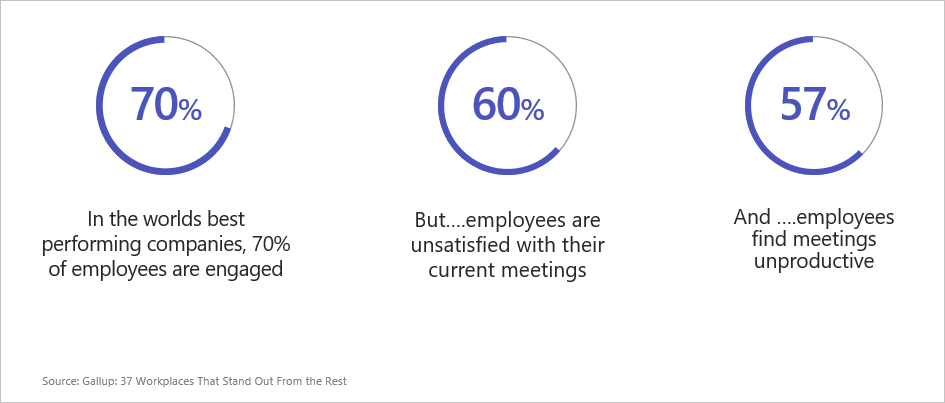
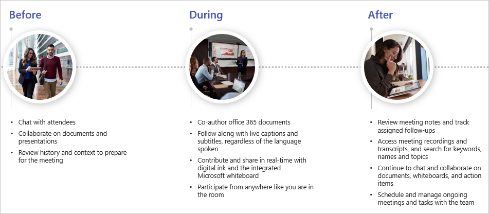
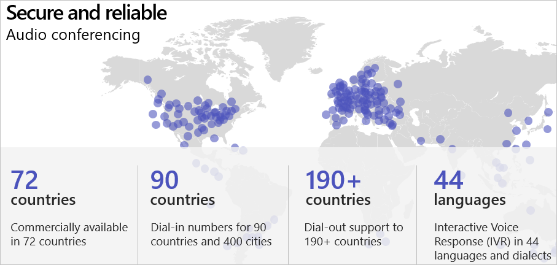

In the world's best-performing companies, 70 percent of employees are engaged but 60 percent are unsatisfied with their meetings. Fifty-seven percent find meetings unproductive.

One of the reasons Microsoft Teams was created was to address these issues. Chats, meetings, and calls all happen in one application, so you're not dealing with different tools to have productive meetings.

Historically, meetings ran in three different silos. There's meeting-related activities that happen before, during, and after a meeting. Meeting collateral isn't always shared effectively. Sometimes the agenda is sent out and then there's a flurry of e-mails discussing and updating the agenda. But Microsoft Teams has a new approach.

- Before the meeting, you can now chat with attendees and collaborate on a single agenda.
- During the meeting, you can coauthor Office 365 documents, contribute with digital ink, and follow along with live captions.  
- After the meeting, you can review notes and continue to chat and collaborate on documents, Microsoft Whiteboards, and action items.

This is the Microsoft Teams meeting lifecycle.

Microsoft Teams offers easy, high-quality experiences using cloud-based technologies to maximize performance using any device type. Microsoft Teams helps remove distractions by allowing you to personalize your video with custom backgrounds and background blur. And, of course, Microsoft 365 is secure and manageable, featuring compliance, security, and manageability that you can have confidence in.

## Dial into meetings with audio conferencing

Audio conferencing allows meeting attendees to call in from a mobile or cell phone while they're traveling, or dial in using a traditional telephone if they have poor internet connectivity. Microsoft audio conferencing is available in 72 countries with dial-in numbers for 90 countries and 400 cities.

You can also dial out to over 190 countries to bring people into a meeting via audio conferencing. The Interactive Voice Response is available in over 44 languages and dialects.

Microsoft Teams audio conferencing is an excellent solution for attendees who need to dial in to participate in a meeting.

## Learn more

- [Meetings in Microsoft Teams](/MicrosoftTeams/tutorial-meetings-in-teams?azure-portal=true)
- [Audio conferencing in Microsoft 365](/microsoftteams/audio-conferencing-in-office-365?azure-portal=true)
