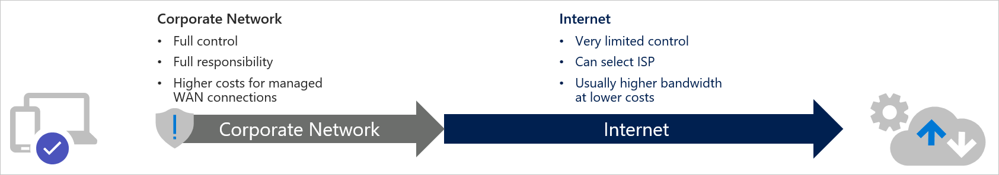
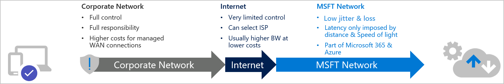
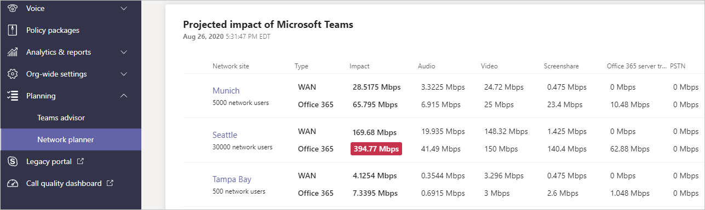

You may be surprised to read that Microsoft operates one of the largest networks on the planet. Microsoft has datacenters across the globe and we need to get them all connected at super high speed with super-low latency. To accomplish this, Microsoft has hundreds of thousands of route miles of privately owned fiber. Microsoft's fiber optic network could stretch to the moon and back, three times over!

The Microsoft network is optimized for media. Optimization is done in several ways, including using fiber connections between regions, prioritizing media traffic throughout the Microsoft global network, and placing edge sites (entry points to the Microsoft network) close to users to reduce latency. Unlike the general internet, or even corporate networks, the Microsoft network knows what media to expect and acts accordingly to prioritize things like Microsoft Teams media.

In the image below, you can see how you generally connect to a website such as LinkedIn or MSN. You have full control and full responsibility for your network until you route to the internet.  The internet offers limited control. You can only choose your Internet Service Provider (ISP) and maybe a DNS provider. Even though the internet can be a little wild, it works well. Your users can get to LinkedIn or MSN fine.

However, when you go to Microsoft 365 things change in a meaningful way. The reliance on the internet shrinks, and the Microsoft network picks up much of the connection. You still start your connection on your corporate network and you're still going to Microsoft 365.

But because the way the Microsoft network is designed, placing edge sites as close as possible to users around the world, the time you spend on the internet is greatly reduced. By reducing the amount of time your traffic spends on the open internet, you minimize things like jitter, latency, and packet loss, all of which can impact Microsoft Teams meeting quality. The Microsoft network has been designed to focus on Microsoft-specific technologies and not the general-purpose internet.

What if you could reduce the corporate network traffic and get your traffic onto that low jitter, low loss, low latency Microsoft network even faster?

Historically, corporate networks were designed with one or two centralized datacenters that housed all the servers and firewalls for the corporation. This connectivity made perfect sense when most network traffic was destined for corporate servers housed in those datacenters. But with the emergence of Software as a Service (SaaS) and Platform as a Service (PaaS) offerings, a lot of traffic is now headed to the internet and not as much traffic is headed to corporate datacenters.

When you add internet-bound, real-time media into the mix, does it still make sense to have corporate internet connectivity only located at centralized datacenters? Is there a way to optimize a corporate network to improve Microsoft 365 performance?

Local Internet breakouts and local DNS resolution are key to optimizing corporate network connectivity to Microsoft 365.

What does this mean? If you have DNS configured so all DNS requests get forwarded to the corporate headquarters datacenter, the Microsoft DNS servers will see the DNS requests as coming from the corporate headquarters and not the local branch. Thus, Microsoft DNS servers will return an accurate DNS response for the corporate headquarters, but not one for the local branch.

The local branch needs local DNS so the Microsoft DNS servers can realize where they are located and give them the optimal DNS response.

You also want to minimize your time transmitting data on the internet. The internet doesn't support Quality of Service. On the internet, there are things you can't control:

- You can't control the routing.
- You can't control what other network traffic is there.
- You can't control bandwidth.
- You can't control much!

The less time you spend on the internet connecting to Microsoft 365, the better your performance will be. Similarly, the more time you spend on the Microsoft network, the better your performance will be.
 
The way to do that is to introduce local internet breakouts where it makes sense. Local internet breakouts, also known as internet egress points, are locations where your local network traffic exits to the internet. There's a lot to discuss and a lot to decide regarding where you should have local internet breakouts.

- Where should you place your local internet breakouts?
- How many people are going to be using that internet breakout?
- What kind of bandwidth is available at the breakout locations?

You'll need to decide if every office or every location needs to have a local internet breakout. But if you're a regional, national, or global corporation, you should certainly consider local breakouts. Passing your traffic halfway across the country or across the globe just to get to the internet doesn't make sense when dealing with Microsoft 365 in general and Microsoft Teams media specifically.

## What is a peering point?

Microsoft has thousands of peering points across the globe. What is a peering point? Good question!

A peering point is a network location where two or more networks meet. When your ISP passes your traffic from their network to the Microsoft network, that is a peering point. The more peering points Microsoft has, the faster your ISP can  pass the traffic over to Microsoft.

If you have the choice, choose an ISP that peers directly with Microsoft. This helps assure that the traffic takes a direct, optimal path from the corporate network (or even from your home) to Microsoft. Microsoft is peered with over 2700 ISPs globally in 190 locations and 38 countries.

Do you need to increase bandwidth when implementing Microsoft 365? To help you answer that question, there is a network planner in the Teams admin center. It gives you estimates of how much bandwidth is going to be needed at any given location and helps guide you to make sure you have enough bandwidth for Microsoft Teams.

## Learn more

- [Microsoft peering locations](https://www.peeringdb.com/asn/8075?azure-portal=true)
- [Microsoft 365 and Office 365 URLs and IP address ranges](/microsoftteams/office-365-urls-ip-address-ranges?azure-portal=true)
- [Microsoft 365 network connectivity principles](/microsoft-365/enterprise/microsoft-365-network-connectivity-principles?azure-portal=true)
- [Networking up (to the cloud)—One architect's viewpoint](/microsoft-365/solutions/networking-design-principles?azure-portal=true)
