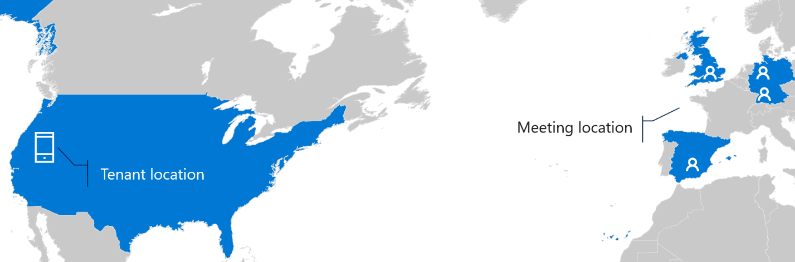

When two people call each other, it's a direct or a peer-to-peer call. That means the media will travel directly from your workstation to your peers' workstation,  assuming things like firewalls, proxy servers, and NATs aren't blocking any traffic.

But if there's firewalls blocking direct communication between two Teams clients, how do they connect? They'll use a server called a *transport relay*. Both Teams clients will connect to the transport relay and it forwards the traffic to each Teams client. As soon as you add a third person to the Teams call, it will automatically be promoted to a meeting and all attendees will connect to a transport relay.

## Where are meetings hosted?

If you schedule a meeting with attendees from around the globe, where will that meeting be hosted? The answer is . . . it depends on who joins the meeting first.

Even if you are the one who sends out the Teams meeting invite, but a colleague in a distant country is the first one to join the meeting, that meeting will be hosted in the Microsoft 365 datacenter for that country. This means that your media must travel to that datacenter where it is then combined with the media from your colleague and sent back to you. The first person to join a Teams meeting dictates where that meeting will be hosted. The theory is that most attendees of a meeting will be in the same basic region and it really doesn't matter who joins first.

When it does matter is if 10 people are invited to a meeting and nine of them are in region A and the 10th invitee is in region B. If that 10th invitee joins the meeting first, the media from the nine invitees in region A must now travel to the Microsoft datacenter in region B to be joined and sent back.

> [!TIP]
> If you've set up a meeting like this, join it a little earlier to help keep the media in the region where most of the attendees are located.

What happens if your Microsoft 365 tenant is based in North America, but all the attendees are based in Europe? Does the media have to travel back to North America?

No. The media will travel to the Microsoft datacenter closest to the first person who joined the meeting. In this case, that person is in Europe along with the other attendees. The geographic location of the Microsoft 365 tenant has no bearing on where the meeting will be hosted.

## Learn more

- [Microsoft Teams call flows](/microsoftteams/microsoft-teams-online-call-flows?azure-portal=true)
